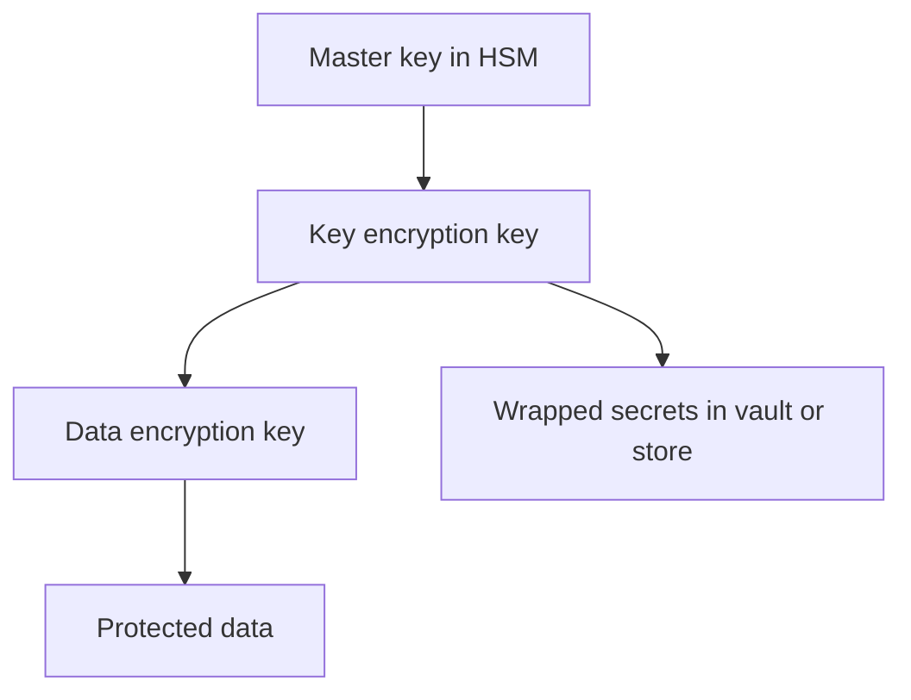
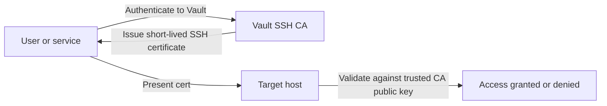
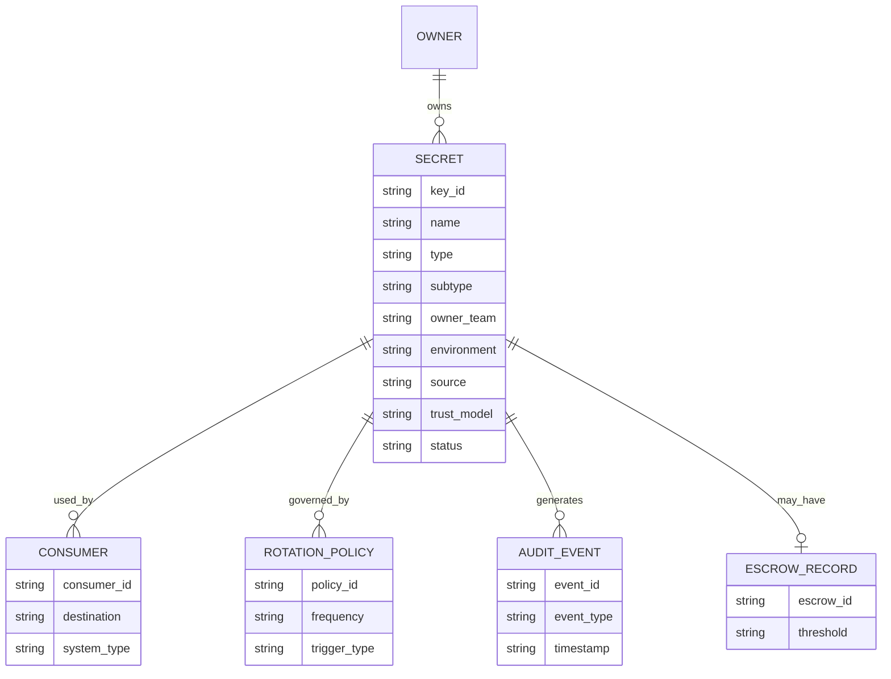
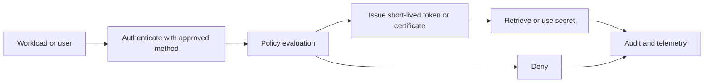
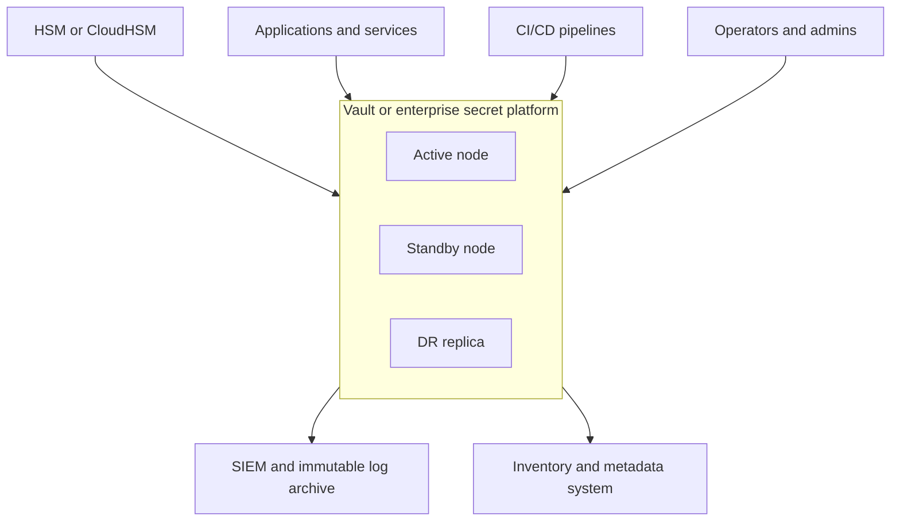
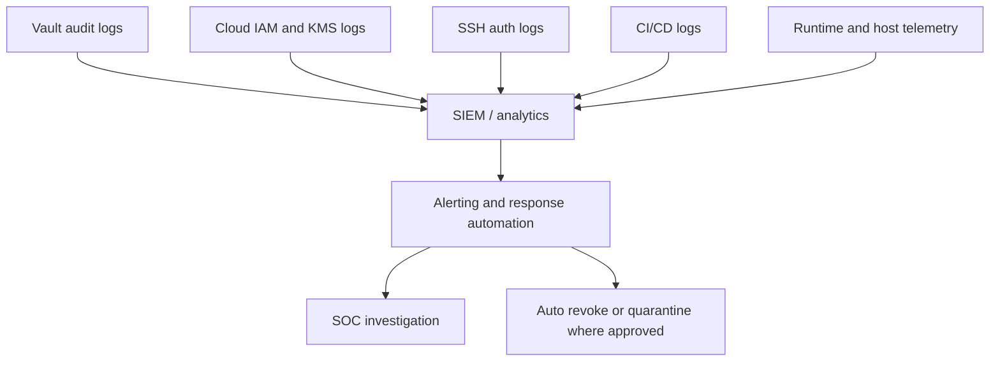
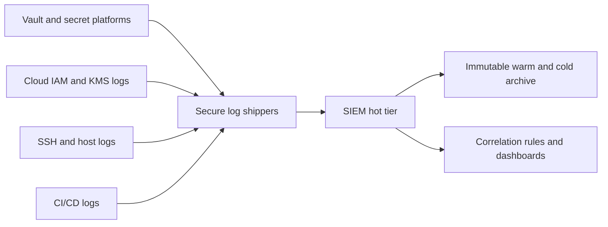
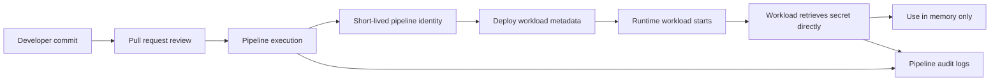

# Secrets, Keys, and Cryptography Technical Standards v1.4

> **Revision Note (v1.2):** This edition incorporates the full text of the prior comprehensive standards document used in this workspace. For regulatory interpretation and control prioritization, applicable SFC requirements and Cap. 653 obligations are treated as primary external drivers. HKMA references are retained as secondary benchmark material unless separately adopted or contractually required.

> **Revision Note (v1.3):** This edition adds CSA Cloud Controls Matrix (CCM) cross-references, clarifies high-level control domains for secrets, key management, cryptography, and strengthens explicit linkages to identity and access management requirements.

> **Revision Note (v1.4):** Appendix A has been removed from the standards document, Appendix B has been renamed to Appendix A, the change-control section has been refreshed, and a document-level external link register has been standardized.
**Organization Type:** Critical Financial Services Provider  
**Document Type:** Architecture and Standards  
**Version:** 1.4  
**Classification:** Internal Restricted  
**Review Cycle:** Annual or on material change

---

## Table of Contents

- [CSA CCM Cross-Reference Overview](#csa-ccm-cross-reference-overview)
- [Identity and Access Linkages](#identity-and-access-linkages)

1. [Purpose and Scope](#1-purpose-and-scope)
2. [Governing Standards and Frameworks](#2-governing-standards-and-frameworks)
3. [Definitions and Secret Type Taxonomy](#3-definitions-and-secret-type-taxonomy)
4. [Lifecycle Model](#4-lifecycle-model)
5. [Secret Type Requirements](#5-secret-type-requirements)
6. [Service Account Framework](#6-service-account-framework)
7. [SSH Key Pair Framework](#7-ssh-key-pair-framework)
8. [Inventory and Metadata Schema](#8-inventory-and-metadata-schema)
9. [Encryption Requirements](#9-encryption-requirements)
10. [Trust Relationships and Authentication Models](#10-trust-relationships-and-authentication-models)
11. [Secrets Storage and Platform Solutions](#11-secrets-storage-and-platform-solutions)
12. [Key Rotation and Renewal Framework](#12-key-rotation-and-renewal-framework)
13. [Key Escrow and Recovery](#13-key-escrow-and-recovery)
14. [Abuse Detection and Anomaly Monitoring](#14-abuse-detection-and-anomaly-monitoring)
15. [Emergency Compromise Handling and Incident Response](#15-emergency-compromise-handling-and-incident-response)
16. [Audit, Logging and Accountability](#16-audit-logging-and-accountability)
17. [CI/CD Secrets Management](#17-cicd-secrets-management)
18. [Compliance Mapping](#18-compliance-mapping)
19. [Roles and Responsibilities](#19-roles-and-responsibilities)
20. [References](#20-references)

**Appendices:**
B. [Policy Summary](#appendix-b-policy-summary)
## Regulatory Positioning

This standards document is implemented with the following external reference priority:

1. **Primary:** Cap. 653 obligations and applicable SFC cybersecurity requirements, circulars, codes, and guidance relevant to licensed activities.
2. **Secondary:** HKMA materials as informative benchmark references where they help strengthen control design or evidence expectations.
3. **Supporting Frameworks:** NIST CSF 2.0, NIST SP 800-57, NIST SP 800-63, NIST SP 800-131A, PCI DSS, and other technical baselines adopted by the enterprise.

Where a requirement appears stricter in an adopted benchmark, management may elect to implement the stronger control as enterprise standard.

## 1. Purpose and Scope

This framework defines the architecture, control requirements, operational procedures, and technical standards for managing secrets and cryptographic keys across the enterprise.

It applies to all environments, including production, disaster recovery, staging, development, end-user platforms, infrastructure platforms, cloud services, CI/CD systems, security tooling, and third-party integrations.

Where a Hong Kong designated authority issues a sector-specific code of practice, that sectoral code should be read together with this framework and take precedence for any additional sector-specific obligations.

### 1.1 Objectives

- Protect authentication secrets, API keys, service credentials, certificates, SSH identities, and cryptographic keys.
- Establish a full lifecycle model from request through destruction.
- Define inventory, ownership, trust relationships, rotation, retirement, escrow, audit, and emergency response requirements.
- Standardize technical platforms for secure storage, issuance, retrieval, rotation, and monitoring.
- Align implementation and governance to NIST, OWASP, PCI DSS, and ISO-aligned control expectations.

### 1.2 In Scope

- API keys and bearer secrets.
- Username and password secrets for service use.
- OAuth2 and OIDC client secrets.
- Symmetric encryption keys, including DEKs, KEKs, and HMAC keys.
- Asymmetric keys, including TLS, mTLS, signing, and certificate authority keys.
- Service accounts and workload identities.
- SSH key pairs and SSH certificates.
- Break-glass credentials and escrow materials.
- Metadata, audit logs, policies, source and destination mappings, and operational evidence.

### 1.3 Out of Scope

- End-user password composition policy except where user credentials interact with privileged platforms.
- Proprietary HSM firmware internals.

---

## 2. Governing Standards and Frameworks

The framework is based on recognized guidance for cryptographic key management, secrets handling, auditability, and resilience.

| Standard / Framework | Relevance to this framework |
|---|---|
| NIST SP 800-57 Part 1 Rev. 5 | Primary source for key lifecycle, cryptoperiods, protection, archival, and destruction. |
| NIST SP 800-57 Part 2 | Governance and organizational practices for key management programs. |
| NIST SP 800-130 | Architectural model for cryptographic key management systems. |
| NIST SP 800-12 Rev. 1 | Introductory NIST security handbook guidance, including cryptography, key management, and foundational control rationale. |
| NIST SP 800-53 Rev. 5 | Core control catalog for access, audit, crypto, monitoring, incident response, and separation of duties. |
| NIST CSF 2.0 | Business-level structure across Govern, Identify, Protect, Detect, Respond, and Recover. |
| OWASP Key Management Cheat Sheet | Practical key storage, wrapping, trust store, rotation, and destruction guidance. |
| OWASP Secrets Management Cheat Sheet | Secret lifecycle, CI/CD, metadata, in-memory handling, and operational implementation patterns. |
| OWASP Logging Cheat Sheet | Logging content, integrity, privacy, and tamper-resistance guidance. |
| OWASP CI/CD Security Cheat Sheet | Pipeline hardening, runner isolation, approval and attribution controls. |
| PCI DSS v4.0 | Financial-sector cryptographic key management and audit expectations, especially for protected data environments. |
| ISO 27001 aligned controls | Asset management, access control, cryptography, secure operations, and vendor oversight. |
| FIPS 140-3 | Validation baseline for cryptographic modules and HSMs used for critical material. |
| NIST SP 800-63 Digital Identity Guidelines | Identity proofing, authentication, federation, authenticator lifecycle, and digital identity assurance guidance relevant to machine and service identities. |
| Hong Kong OCCICS Code of Practice (PCI(CS) Ordinance) | Regulatory baseline for CCS governance, management plans, risk assessment, audit, incident response, access control, cryptography, logging, and documentation expectations for CI operators in Hong Kong. |

### 2.1 Hong Kong regulatory overlay

For organizations governed in Hong Kong, the **Code of Practice pursuant to the Protection of Critical Infrastructures (Computer Systems) Ordinance** should be treated as a regulatory overlay on top of this standard. The Code is described as practical guidance rather than subsidiary legislation, but the Commissioner may use it as the reference point when assessing compliance and issuing directions.

| Hong Kong CoP topic | Practical implication for this standard |
|---|---|
| Board or senior-management endorsement and review | The computer-system security management plan should be formally endorsed and reviewed at least once every two years, and earlier after material changes. |
| Cross-reference and alternative controls | Where this framework is implemented through multiple policies and standards, maintain clear cross-references, and document compensating controls when exact requirements cannot be met. |
| Asset inventory and architecture documentation | Maintain up-to-date inventories, diagrams, upstream and downstream dependencies, asset owners, and supporting documentation for critical systems. |
| Access control and privileged access | Enforce least privilege, annual review of access rights, unique user IDs, separate privileged accounts or just-in-time elevation, and MFA where appropriate. |
| Cryptography and key management | Manage cryptographic keys across generation, storage, archive, retrieval, distribution, retirement, and destruction, and store keys separately from encrypted information. |
| Logging and retention | Log critical events including access to password and key files, privileged use, access-right changes, and audit-policy changes; retain logs for at least six months and protect them from alteration or deletion. |
| Remote access and network security | Encrypt remote sessions, implement MFA and logging, segment networks by trust level, and monitor critical nodes with IDS or IPS. |
| Incident readiness | Maintain emergency response plans, risk assessments, security audits, and notification processes for incidents and material changes. |

### 2.2 Control families most used

| Area | Main standards linkage |
|---|---|
| Inventory and ownership | NIST CM-8, AC-2, NIST CSF ID.AM |
| Access control and least privilege | NIST AC-2, AC-3, AC-5, AC-6 |
| Authenticator and digital identity lifecycle | NIST SP 800-63, NIST IA-5 |
| Authenticator management | NIST IA-5 |
| Key establishment and management | NIST SP 800-12, NIST SP 800-57, NIST SC-12, SC-13 |
| Data and key protection | NIST SC-28 |
| Audit and accountability | NIST AU-2, AU-3, AU-6, AU-9, AU-11, AU-12 |
| Monitoring and abuse detection | NIST SI-4, NIST CSF DE.CM |
| Incident response | NIST IR-4, IR-6, NIST CSF RS.MI |
| Backup, recovery, escrow | NIST CP-9, MP-6, RC.RP |

---

## 3. Definitions and Secret Type Taxonomy

A **secret** is a sensitive value that must be protected against unauthorized disclosure because possession or knowledge of that value can grant access, authenticate an identity, authorize an action, or enable other security-relevant operations.

A **cryptographic key** is a parameter used with a cryptographic algorithm that determines the algorithm's operation so that an entity with knowledge of the key can reproduce, reverse, or verify the operation, while one without the key cannot.

In this framework, a **key** is therefore a specialized type of secret used for cryptographic operations, while a **secret** is the broader category that also includes passwords, bearer tokens, client secrets, and similar sensitive credentials.

A **credential** is the secret or key material presented to authenticate a user, machine, workload, or service.

A **machine identity** is the system or workload identity itself, together with the credential or key material bound to it.

### 3.0 Why secrets and key management matter

The proper management of secrets and cryptographic keys is essential to the effective use of security controls, because the protection achieved by authentication, encryption, signing, and access control depends on the protection afforded to the underlying secret or key material.

If a secret is disclosed, the affected control is often **bypassed rather than attacked**, because an unauthorized party can authenticate or authorize directly with the exposed value instead of exploiting a software flaw or breaking a cryptographic algorithm.

For that reason, secrets, machine-identity credentials, trust anchors, signing keys, and similar material should be treated as high-value assets in threat models and as Tier-0 or equivalent material in zero-trust-oriented designs.

Secrets and keys are also a recurring cause of compromise when mishandled through hard-coding, repository exposure, insecure local storage, overbroad distribution, or plaintext logging.

For organizations governed in Hong Kong, the OCCICS Code of Practice reinforces the need for documented security management plans, access control, cryptographic protection, logging, audit, and evidence-backed governance for covered systems.

### 3.1 Secret classes

| Secret class | Typical examples | Primary use | Security characteristics |
|---|---|---|---|
| API secrets | API keys, webhook secrets, HMAC shared secrets | Service-to-service or external API authentication | Usually bearer or shared secret; tightly scoped and rotated frequently |
| Credential secrets | Service passwords, database credentials, client secrets | Authentication to systems or platforms | Prefer dynamic issuance over long-lived storage |
| Symmetric keys | AES DEKs, KEKs, HMAC keys | Encryption and integrity | Strong lifecycle and key hierarchy required |
| Asymmetric private keys | TLS private keys, code-signing keys, mTLS client keys, SSH private keys | Authentication, signing, and encryption | Private keys require strongest protection |
| Trust anchors and issuing keys | CA roots, intermediate CA keys, SSH CA keys | Establish trust relationships | Limited issuance paths and strict custody required |
| Recovery material | Escrow shards, unseal shares, break-glass credentials | Recovery and continuity | Must be isolated from routine operational use |

### 3.2 Key and credential distinctions

| Item type | What it is | Typical examples | Primary function | Handling expectation |
|---|---|---|---|---|
| Secret | Broad class of sensitive values whose disclosure can enable access or privileged action | Passwords, bearer tokens, API secrets, client secrets | Access, authorization, or privileged function | Centralized storage, access control, rotation, audit |
| Cryptographic key | Specialized secret used by a cryptographic algorithm | DEK, KEK, private signing key, HMAC key | Encryption, decryption, signing, verification, integrity | Key hierarchy, cryptoperiod, wrapping, archival, destruction |
| Credential | Secret or key material presented for authentication | Password, token, private key, client secret | Proves identity to a verifier | Authenticator lifecycle and revocation required |
| Identity | The principal itself, not the secret | User account, service account, workload identity, host identity | Ownership of permissions and accountability | Governed as an identity object with owner, scope, and entitlement review |
| Authenticator | The means used to prove the identity | Password, token, certificate/private key pair, signed assertion | Authentication event | Managed separately from the identity object |

### 3.3 Secret type taxonomy for enterprise design

| Category | Enterprise examples | Source of truth | Typical rotation model | Design-document requirement |
|---|---|---|---|---|
| Human authentication secrets | Admin passwords, privileged credentials | IAM, PAM, identity platform | Policy-driven or event-driven | Record owner, system, review model, and emergency process |
| Service authentication secrets | DB passwords, API client secrets, broker credentials | Vault, secret manager, platform API | Automatic or scheduled | Record dependency set, consumers, rotation owner, rollback path |
| Machine identity credentials | mTLS certs, workload tokens, SSH host credentials | PKI, identity provider, attestation system | Short-lived renewal or certificate lifecycle | Record issuer, trust boundary, renewal method, and revocation path |
| Data protection keys | DEKs, KEKs, HSM-managed encryption keys | KMS, HSM, crypto service | Cryptoperiod-based | Record algorithm, hierarchy, custody, archival, destruction |
| Trust anchors | CA roots, intermediate CA keys, SSH CA keys | HSM-backed PKI or trust service | Ceremony-based or rare controlled rollover | Record ceremony, custodians, dependent systems, emergency rollover |
| Recovery material | Escrow shares, break-glass secrets | Escrow service, offline storage, split custody | Test-based and exceptional use only | Record storage model, holders, access conditions, post-use rotation |

### 3.4 Identity, account, and cryptographic material distinctions

The framework distinguishes between an **account or principal**, the **credential or key used to authenticate as that principal**, and the **cryptographic key used to protect data**.

| Class | What it represents | Typical examples | Primary purpose | Lifecycle emphasis | Handling standard |
|---|---|---|---|---|---|
| Service account | A non-human principal with permissions in a platform or application | Cloud IAM service account, DB service account, Kubernetes service account, application technical user | Authorization boundary and ownership of privileges | Provisioning, approval, periodic entitlement review, deprovisioning | Govern as an identity object with owner, scope, review date, and role mapping |
| Machine identity credential | The material a system uses to prove it is a known workload or host | mTLS client certificate and private key, SSH host certificate, workload identity token, signed instance identity | Authentication of a workload, VM, node, or service | Issuance, trust validation, renewal, revocation, attestation, runtime protection | Prefer short-lived, attested, or certificate-based identity rather than long-lived static shared secrets |
| Service authentication secret | A secret that lets a workload authenticate to another system on behalf of its service account | Client secret, service password, API token, bootstrap secret, database password | Service-to-service authentication | Rotation, lease TTL, dependency mapping, emergency replacement | Central store, scoped delivery, short lifetime where possible |
| Data protection key | A cryptographic key used to encrypt, decrypt, or integrity-protect information | DEK, KEK, HMAC key, tokenization key | Confidentiality and integrity protection | Cryptoperiod management, wrapping hierarchy, archival, destruction, re-encryption | HSM or KMS anchored, strict key hierarchy, store separately from protected data |
| Trust anchor or issuing key | A key used to establish or delegate trust | CA root key, intermediate CA key, SSH CA key, code-signing root | Trust establishment and chain validation | Ceremony-based custody, issuance governance, emergency rollover | Tier 1 controls, dual control, threshold recovery, restricted use |
| Recovery material | Material used only for continuity or emergency recovery | Escrow shard, break-glass credential, unseal share | Recovery and continuity | Ceremony, testing, physical or split storage, post-use rotation | Never used for day-to-day runtime access |

#### Practical distinction rules

- A **service account** is the identity object that owns permissions.
- A **machine identity credential** is the proof that the workload is that identity.
- A **service authentication secret** is what the workload presents to another system after it has assumed or been bound to the service account.
- A **data protection key** does not identify the workload; it protects data or verifies integrity.
- A **trust anchor** should not be treated like a routine application secret because compromise affects all dependent identities or certificates.

#### Example mappings

| Example | Identity object | Authentication material | Protected function |
|---|---|---|---|
| Kubernetes workload calling an internal API | Kubernetes service account | OIDC service account token or mTLS client certificate | Authenticates workload to Vault, API gateway, or service mesh |
| ECS virtual machine in Huawei VPC | VM or workload identity | IAM token, instance-bound credential, or retrieved bootstrap secret | Authenticates VM to CSMS, database, or internal services |
| Application using a DB login | Service account in database | Dynamic DB password or client certificate | Authenticates application to database |
| Storage encryption service | Crypto service identity | Service cert or workload token | Uses DEK and KEK to protect stored data |
| Internal PKI issuing TLS certs | CA service identity | CA private key under HSM control | Establishes trust for issued certificates |

### 3.5 Non-secrets and excluded sensitive values

For clarity, not every sensitive or security-relevant value is a secret.

A value is in scope as a **secret** under this framework when its disclosure can by itself, or in combination with realistically available context, grant access, authenticate an identity, authorize an action, bypass a control, or enable misuse of protected cryptographic operations.

The following are **not secrets**, provided they do not enable access, privilege, impersonation, or cryptographic compromise on their own:

| Item | Normally treated as secret? | Clarification |
|---|---|---|
| Public keys | No | Public keys are intended for distribution and validation use. They are not secrets, although their authenticity and binding to the correct identity must still be protected. |
| Public certificates | No | Public certificates are normally distributable trust artifacts. They are not secrets unless bundled with private-key material or other authenticators. |
| Usernames or identifiers alone | No | A username, service name, account ID, client ID, certificate subject, or workload identifier is not a secret unless it is combined with a password, token, private key, or other authenticator. |
| Non-privileged configuration values | No | Configuration values that do not grant access or privilege, such as hostnames, ports, feature flags, region names, timeout values, or routing labels, are not secrets. |
| Encrypted secret values at rest | Not by themselves, conditionally | Encrypted secret blobs are not treated as plaintext secrets only when the encryption keys are separately protected, access-controlled, and not co-located in a way that makes trivial recovery possible. |
| Secret metadata | Usually no | Secret names, owners, rotation dates, and inventory metadata are normally not secrets, but may still require restricted handling where they expose sensitive architecture or attack paths. |

#### Additional rules

- Public material associated with asymmetric cryptography, such as public keys and public certificates, should still be integrity-protected even though it is not secret.
- Identifiers are not secrets, but they may still be sensitive from a privacy, reconnaissance, or architecture-disclosure perspective.
- Encrypted values should not be treated as safely non-secret if the decryption key is stored in the same repository, host, container, script, deployment artifact, or administrative workflow.
- When in doubt, classify a value based on whether disclosure would materially enable unauthorized access, impersonation, privilege escalation, or control bypass.

#### Enterprise interpretation

This distinction prevents over-classifying routine identifiers and public trust material while ensuring the organization still protects the items that actually function as authenticators, access enablers, or cryptographic control material.

It also supports clearer inventory records, because architecture documents can separately track:
1. identities and identifiers,
2. public trust material,
3. operational configuration values,
4. true secrets and private cryptographic material.

---

## 4. Lifecycle Model

All secrets and keys must follow a controlled lifecycle with explicit ownership and evidence.

### 4.1 Enterprise lifecycle phases

### 4.2 Lifecycle requirements by phase

| Phase | Mandatory activities |
|---|---|
| Need identified | Business need documented, data classification known, owner assigned, trust relationship defined |
| Design and approval | Algorithm and key type selected, source and destination mapped, platform pattern selected |
| Generate or issue | CSPRNG or HSM-backed generation, metadata bound, cryptoperiod assigned |
| Register in inventory | Unique ID, owner, environment, source, destination, trust scope, storage location, sensitivity tier |
| Distribute securely | TLS 1.3 or equivalent secure transport, wrapped or lease-based delivery, no plaintext tickets or chat transfer |
| Activate | Access policy enforced, consumer validated, alerting enabled |
| Use and monitor | JIT retrieval, in-memory minimization, logging, anomaly monitoring |
| Rotate or renew | Scheduled and event-driven rotation, dependent systems updated, test and rollback defined |
| Deactivate | New issuance blocked, legacy decrypt or verify permitted only where needed |
| Archive | Archived only where justified by business, legal, or decryptability needs |
| Destroy or zeroize | Secure destruction per media and platform type, evidence captured |
| Compromise handling | Immediate revocation, blast radius review, cascading rotation, incident record |

### 4.3 State model

| State | Description |
|---|---|
| Requested | Awaiting design approval and owner confirmation |
| Generated | Secret exists but is not yet active |
| Active | Used in production or live service path |
| Suspended | Temporarily blocked pending review or incident |
| Deprecated | Replaced by a newer version; read-only or drain phase |
| Archived | Retained only for decrypt, verify, legal, or recovery needs |
| Destroyed | Removed or zeroized with evidence |
| Compromised | Explicit incident state requiring emergency handling |

---

## 5. Secret Type Requirements

This section defines operational controls by secret type.

### 5.1 API keys and shared application secrets

| Requirement area | Standard |
|---|---|
| Generation | Minimum 256-bit entropy from approved CSPRNG |
| Storage | Central secret store only; never in code, tickets, chat, or unencrypted config |
| Scope | Limit by API, action, IP range, environment, and account |
| Delivery | Returned once or retrieved at runtime via SDK or agent |
| Rotation | 30 to 90 days based on provider support and risk |
| Monitoring | Baseline volume, geolocation, ASN, method, and failure patterns |
| Emergency action | Immediate revoke and vendor notification where applicable |

### 5.2 Credentials and passwords used by systems

| Requirement area | Standard |
|---|---|
| Pattern | Prefer dynamic credentials over static passwords |
| Length and randomness | 20+ characters for non-human secrets, generated not human chosen |
| Interactive login | Disabled for service accounts unless exception approved |
| Rotation | 30 to 90 days if static; minutes to hours if dynamic |
| Storage | Vault or equivalent; no environment variable for persistent privileged credentials |
| Recovery | Re-issue rather than disclose historical value |

### 5.3 Symmetric keys

| Requirement area | Standard |
|---|---|
| Algorithm | AES-256 for encryption, HMAC-SHA-256 or stronger for integrity |
| Hierarchy | DEK wrapped by KEK, KEK protected by HSM master material |
| Export | KEKs and master keys non-exportable wherever possible |
| Rotation | DEKs annually or sooner, KEKs every two years or sooner |
| Re-encryption | Defined process for rekey and data re-encryption |
| Destruction | Zeroize keys and revoke associated wrapping relationships |

### 5.4 Asymmetric keys

| Requirement area | Standard |
|---|---|
| Algorithms | RSA-4096 or EC P-384 for critical use; Ed25519 acceptable for SSH identity where approved |
| Generation | Prefer HSM or CA engine generation |
| Private key exposure | Private keys must not be exported from HSM for Tier 1 use cases |
| Public distribution | Through trust store or certificate repository |
| Renewal | New key pair for renewals unless managed exception |
| Revocation | CRL, OCSP, or equivalent trust-store update process |

### 5.5 Key hierarchy

---

## 6. Service Account Framework

Service accounts are non-human identities used by applications, automation, CI/CD jobs, and infrastructure components.

### 6.1 Requirements

- One service account per workload or bounded function.
- No shared service accounts across unrelated services.
- No standing interactive login unless explicitly approved.
- Prefer short-lived tokens or dynamic credentials over static secrets.
- Every service account must have an owner, purpose, environment, and access review date.

### 6.2 Service account types

| Type | Preferred auth model | Typical TTL |
|---|---|---|
| Cloud workload identity | OIDC / workload identity federation | Minutes to 1 hour |
| Kubernetes workload | Service account token with projected short-lived token or Vault auth | 1 hour |
| Database automation account | Vault dynamic DB secret | 15 minutes to 24 hours |
| Broker or middleware account | mTLS cert or short-lived token | 24 hours to 90 days depending on platform |
| Legacy system account | Static secret with exception | 30 to 90 days |

### 6.3 Lifecycle diagram

### 6.4 Mandatory controls

| Control | Requirement |
|---|---|
| Ownership | Named owner and backup owner required |
| Scope | Resource-level least privilege only |
| Review | Review every 90 days, earlier for privileged accounts |
| Dormancy | Flag no-use >30 days for decommission review |
| Monitoring | Log all auth, role assumption, token issuance, and privileged operations |
| Secrets pattern | Prefer issued tokens or dynamic passwords, not hard-coded values |

---

## 7. SSH Key Pair Framework

SSH identity for systems and services must move from static long-lived keys to short-lived SSH certificates wherever feasible.

### 7.1 Target architecture

### 7.2 SSH use cases

| Use case | Recommended pattern | TTL |
|---|---|---|
| Operator administrative access | SSH certificate issued after MFA and policy check | 1 hour |
| CI/CD deployment to hosts | Per-job SSH certificate | Less than 1 hour |
| Service-to-system trust | Host or service SSH certificate | 1 to 24 hours |
| Legacy device without cert support | Static key pair under exception | Max 90 days |

### 7.3 SSH control requirements

| Control | Requirement |
|---|---|
| Key type | Ed25519 preferred for SSH identity unless compatibility requires RSA-4096 |
| CA trust | Hosts trust CA public key, not many individual static keys |
| Principals | Certificate principals must be explicit and non-wildcard |
| Private key handling | No storage in code repos or shared home directories |
| Agent use | Use ephemeral agents and clear keys after session or job completion |
| Incident handling | Revoke or rotate CA and redistribute trust promptly for widespread compromise |

---

## 8. Inventory and Metadata Schema

A complete inventory is mandatory for lifecycle management, blast-radius analysis, and audit evidence.

### 8.1 Required metadata fields

| Field | Required | Description |
|---|---|---|
| key_id | Yes | Globally unique identifier |
| name | Yes | Human-readable secret name |
| type | Yes | API, credential, symmetric, asymmetric, service account, SSH, escrow |
| subtype | Yes | More specific classification |
| owner_team | Yes | Responsible team |
| owner_contact | Yes | Accountable individual or shared mailbox |
| environment | Yes | Production, DR, staging, development |
| source | Yes | Where the secret originates |
| destination | Yes | Consuming systems or services |
| trust_model | Yes | OIDC, mTLS, PKI, HMAC, AppRole, etc. |
| storage_location | Yes | Vault path, KMS ARN, HSM partition, or similar |
| algorithm | Conditional | Required for cryptographic keys |
| sensitivity_tier | Yes | Tier 1 to Tier 4 |
| created_at | Yes | Creation timestamp |
| expires_at | Yes | Expiry or next review timestamp |
| last_rotated | Yes | Last completed rotation |
| rotation_policy | Yes | Schedule or event condition |
| status | Yes | Requested, active, deprecated, archived, destroyed, compromised |
| escrow_reference | Conditional | Recovery material linkage |
| in_memory_protection | Conditional | HSM-only, enclave, mlock, ephemeral, standard |
| compliance_tags | Yes | PCI, SOX, ISO, etc. |

### 8.2 Inventory operating requirements

- Daily reconciliation across Vault, KMS, PKI, CMDB, and cloud IAM.
- Discovery scanning for hard-coded secrets in repositories, images, and configuration stores.
- Owner recertification every 90 days for production entries.
- Mandatory dependency maps for Tier 1 and Tier 2 secrets.
- Automatic orphan detection for secrets with no owner, no consumer, or no recent activity.

### 8.3 Relationship diagram

### 8.4 Operational inventory for acquisition and rotation methods

In enterprise environments, the inventory must record not only **what** the secret or key is, but also **how it is obtained, how it is rotated, who coordinates it, and what operational dependency exists**. OWASP recommends storing metadata such as intended consumers, purpose, type, and when manual rotation is required, and NIST key-management guidance emphasizes inventories, accountability, audit, and documented distribution methods. [R6](https://cheatsheetseries.owasp.org/cheatsheets/Secrets_Management_Cheat_Sheet.html)[R1](https://csrc.nist.gov/pubs/sp/800/57/pt1/r5/final)[R1](https://csrc.nist.gov/pubs/sp/800/57/pt1/r5/final)

#### 8.4.1 Acquisition and rotation method classification

| Operational pattern | Typical examples | How obtained | Rotation method | Documentation requirement |
|---|---|---|---|---|
| Platform-issued dynamic secret | Vault DB credential, short-lived cloud token | Retrieved programmatically at runtime from secret platform | Automatic by lease renewal or re-issuance | Record platform, auth method, TTL, and consuming workload |
| Internal automated secret | Internal API key generated by enterprise platform | Generated by internal secret manager, PKI, or KMS | Scheduled automation or event-driven workflow | Record job, trigger, rollback path, and dependency list |
| External party managed secret | Vendor API key, partner certificate, external client secret | Received from external portal, secure channel, or partner workflow | External-party process, with internal calendar and owner follow-up | Record external owner, portal URL, contact path, issue date, expiry, and coordination lead |
| Console-regenerated secret | API gateway key, SaaS console secret, partner portal token | Created or regenerated through admin console | Manual or semi-manual console action | Record console URL, admin role, exact steps, approval path, and evidence link |
| Manual coordinated certificate or key | mTLS certificate exchange, SSH trust onboarding, bilateral key ceremony | Coordinated with another internal or external team | Manual renewal with change window and validation steps | Record counterparties, trust boundary, validation steps, notice period, and rollback plan |
| Static exception secret | Legacy app password or device secret with no API | Manual placement or limited scripting | Manual rotation | Record exception approval, compensating controls, storage path, and retirement target date |

#### 8.4.2 Required operational inventory fields

| Field | Purpose |
|---|---|
| Acquisition method | Distinguishes runtime retrieval, API issuance, portal download, manual exchange, or console generation |
| Rotation method | Distinguishes automatic, event-driven, scheduled manual, vendor-driven, or emergency-only rotation |
| Rotation owner | Names the accountable internal team for execution and evidence capture |
| Coordinating party | Identifies external vendor, internal platform owner, or partner team if coordination is required |
| Rotation interface | Stores API endpoint, vault path, console URL, runbook name, or ticket workflow reference |
| Notice period | Captures how much lead time is required for partner or business coordination |
| Validation method | Records how the new secret is tested before promotion, such as connectivity test, handshake test, or application smoke test |
| Rollback method | Documents whether the previous version remains valid, for how long, and how fallback is executed |
| Evidence location | Links to ticket, pipeline run, job ID, ceremony record, or audit log query |
| Dependency set | Lists impacted applications, APIs, gateways, partners, hosts, or certificates |

#### 8.4.3 Source and rotation register template

| ID | Secret / Key | Source type | How obtained | Rotation type | Rotation owner | Coordination required | Interface / system | Validation | Rollback | Notes |
|---|---|---|---|---|---|---|---|---|---|---|
| SK-001 | payments-db-cred | Internal dynamic | Vault DB engine | Automatic lease re-issue | Platform team | No | `vault://database/payments` | DB login test | Previous lease overlap | Runtime only |
| SK-002 | partner-api-key | External vendor | Partner portal download | Manual scheduled | Payments team | Yes, vendor | Vendor console URL | Test API call | Previous key valid for 7 days | External dependency |
| SK-003 | gateway-client-secret | Internal console | API gateway admin console | Semi-manual regenerate | API platform team | No | Gateway admin UI | Client auth test | Prior version drain window | Needs CAB window |
| SK-004 | bilateral-mtls-cert | External coordinated | CA or partner exchange | Manual coordinated renewal | Security engineering | Yes, counterparty | PKI portal + ticket | TLS handshake and app test | Old cert overlaps until cutover | Formal runbook |
| SK-005 | legacy-device-password | Static exception | Manual secure entry | Manual | Infra ops | Maybe | Local device workflow | Login test | Manual restore | Exception tracked |

#### 8.4.4 Documentation requirements for design documents

Every solution design document should include a **Secrets and Keys Register** plus an **Operational Rotation Matrix**. OWASP API inventory guidance recommends documenting integrated services, their role, exchanged data, and sensitivity, which is directly applicable to external-party secrets, API gateway credentials, and partner trust relationships. [R23](https://owasp.org/API-Security/editions/2023/en/0xa9-improper-inventory-management/)[R6](https://cheatsheetseries.owasp.org/cheatsheets/Secrets_Management_Cheat_Sheet.html)

The design document should state, for each secret or key, whether the lifecycle is fully automated, partially automated, externally coordinated, or manual by exception. It should also identify which secrets are internal-only, externally issued, console-generated, or ceremony-based so operations teams know how to rotate them without discovering the process during an incident. [R6](https://cheatsheetseries.owasp.org/cheatsheets/Secrets_Management_Cheat_Sheet.html)[R1](https://csrc.nist.gov/pubs/sp/800/57/pt1/r5/final)

---

## 9. Encryption Requirements

All secrets must be encrypted at rest. Protection in transit and, for sensitive classes, in memory is also required.

### 9.1 Encryption at rest

| Tier | Requirement |
|---|---|
| Tier 1 | HSM-backed, non-exportable where supported, AES-256 or platform equivalent |
| Tier 2 | Secret store encryption with HSM-backed master key or KMS CMK |
| Tier 3 | Managed encryption with enterprise-approved key management |
| Tier 4 | Managed platform encryption minimum baseline |

### 9.2 Encryption in transit

- TLS 1.3 minimum for secret retrieval and management traffic unless documented platform limitation exists.
- Mutual TLS required for privileged service-to-service secret retrieval paths where feasible.
- No plaintext transmission over email, ticketing tools, instant messaging, or shell history.

### 9.3 Encryption and protection in memory

| Sensitivity | Requirement |
|---|---|
| Tier 1 | Cryptographic operation should occur fully inside HSM or enclave whenever possible |
| Tier 1 and Tier 2 | Use `mlock()` or platform equivalent to prevent swap for temporary in-memory key material |
| Tier 1 and Tier 2 | Zeroize memory after use and avoid immutable string types for key bytes |
| Tier 2 | Prefer sidecar or agent with short-lived in-memory cache over application-persistent copies |
| Tier 3 | Minimize retention time and avoid debug or crash dump exposure |

### 9.4 Memory handling by implementation model

| Model | Requirement |
|---|---|
| HSM-backed signing or unwrap | Preferred for private keys, KEKs, and trust anchors |
| Nitro enclave / SGX / equivalent | Approved for workloads needing protected in-memory operations |
| Agent sidecar in RAM-backed volume | Approved for service secrets and certificates |
| Direct application memory | Allowed only when higher-assurance patterns are impractical |

---

## 10. Trust Relationships and Authentication Models

Trust models define how systems prove identity before receiving or using secrets.

### 10.1 Approved trust models

| Trust model | Typical use cases | Notes |
|---|---|---|
| PKI / certificate chain | TLS, mTLS, signing, SSH CA trust | Best for strong machine identity and trust path validation |
| OIDC / OAuth2 | Workload identity, CI/CD federation, cloud IAM | Prefer short-lived tokens and audience restrictions |
| HMAC shared secret | API request signing, webhook validation | Strong protection required because both parties share material |
| Vault AppRole | Legacy or non-cloud machine auth to Vault | Secret ID must be wrapped and tightly distributed |
| Workload identity federation | Cloud-native machine identity | Preferred over static cloud access keys |
| Threshold trust | Escrow, break-glass, recovery | Used only for recovery and governance workflows |

### 10.2 Trust flow

### 10.3 Trust requirements

- Every secret must document the trust model used to obtain it.
- Every machine identity must bind to a concrete workload, service, namespace, project, or host.
- No wildcard trust relationship for privileged secrets.
- Trust anchors must be inventoried, reviewed, and protected with Tier 1 controls.

---

## 11. Secrets Storage and Platform Solutions

The enterprise should standardize on a primary secret platform and limited secondary platform patterns.

### 11.1 Preferred platform pattern

| Capability | Preferred solution |
|---|---|
| Centralized secret storage | HashiCorp Vault Enterprise or equivalent enterprise secret platform |
| HSM-backed custody | CloudHSM, dedicated HSM, or equivalent integrated via PKCS#11 |
| Cloud-native secrets | AWS Secrets Manager, Azure Key Vault, or GCP Secret Manager where aligned to platform strategy |
| Cryptographic key operations | Cloud KMS and/or Vault transit engine with HSM anchoring |
| PKI and SSH certificate issuance | Vault PKI and SSH engines or enterprise CA platform |

### 11.2 Platform capabilities required

| Capability | Requirement |
|---|---|
| Auth methods | OIDC, AppRole, cert auth, cloud identity integration |
| Dynamic secrets | Database, cloud, and service credential issuance |
| Leases | Short-lived tokens and renewable leases |
| Versioning | Support current, pending, previous, and deprecated versions |
| Rotation | Automated rotation hooks or native rotation capability |
| Audit | Structured, immutable-capable audit streams |
| HA and DR | Multi-node availability and cross-region replication |
| Policy | Fine-grained RBAC or ABAC with namespaces or clear segregation |

### 11.3 Reference architecture

### 11.4 Handling approaches by secret type

| Secret type | Recommended handling approach |
|---|---|
| API keys | Vault KV or managed secret store with versioning and scoped distribution |
| Dynamic DB credentials | Vault dynamic secret engine |
| Encryption keys | HSM-backed KMS or Vault transit with HSM anchoring |
| TLS certs | PKI engine with automated issuance and renewal |
| SSH identity | Vault SSH CA or equivalent certificate authority model |
| Break-glass credentials | Separate protected store with multi-party recovery and offline backup |

---

## 12. Key Rotation and Renewal Framework

Rotation must be both scheduled and event-driven.

### 12.1 Rotation principles

- Rotate on cryptoperiod expiry.
- Rotate immediately on compromise, suspected compromise, or personnel risk event.
- Maintain version history sufficient for drain, rollback, or decrypt continuity.
- Test rotation before full promotion where systems depend on continuity.

### 12.2 Rotation schedule

| Secret type | Standard rotation |
|---|---|
| Internal API keys | 30 days |
| External or vendor API keys | 90 days or provider maximum lower limit |
| Static service account passwords | 30 to 90 days |
| Dynamic service credentials | Per lease or under 24 hours |
| OAuth client secrets | 90 days |
| SSH certificates | 1 hour to 24 hours |
| Static SSH keys under exception | 90 days maximum |
| TLS server certs | Renew before expiry, typically 30 days before |
| DEKs | 365 days or on significant data reclassification |
| KEKs | 730 days or on event |
| CA or signing keys | According to PKI or signing policy, typically 1 to 2 years |

### 12.3 Rotation flow

### 12.4 Rotation failure handling

| Condition | Requirement |
|---|---|
| Test failure | Do not promote pending version |
| Production rollback | Defined drain and rollback period required |
| Repeated failure | Escalate to security and application owner |
| Expired secret still in use | Raise incident and prioritize remediation |

### 12.5 Operational rotation considerations

Rotation is an operational process as much as a cryptographic one. OWASP notes that manual rotation is error-prone and should be automated where possible, while NIST-oriented key-management guidance recognizes manual distribution, automated distribution, and key agreement as distinct operational models that need accountability and audit coverage. [R6](https://cheatsheetseries.owasp.org/cheatsheets/Secrets_Management_Cheat_Sheet.html)[R1](https://csrc.nist.gov/pubs/sp/800/57/pt1/r5/final)

#### 12.5.1 Rotation execution models

| Execution model | When to use | Operational considerations |
|---|---|---|
| Fully automated | Dynamic secrets, internally issued certs, platform-generated API credentials | Requires tested automation, health checks, rollback, and monitoring of failed rotations |
| Semi-automated | Console-regenerated keys or keys updated by runbook with API assistance | Requires step-by-step runbook, dual control where privileged, and evidence capture |
| External coordinated | Partner credentials, third-party API keys, bilateral certificates | Requires notice period, named counterpart, test window, and explicit overlap strategy |
| Manual exception | Legacy platforms or non-API devices | Requires exception approval, compensating controls, shorter review cycle, and retirement plan |
| Emergency rotation | Suspected compromise or urgent platform issue | Requires pre-approved playbook, priority contact list, and blast-radius mapping |

#### 12.5.2 Minimum runbook content

| Runbook element | What to document |
|---|---|
| Trigger | Scheduled date, expiry threshold, incident, or vendor notice |
| Preconditions | Required approvals, access roles, maintenance window, and backup status |
| Source of new value | Whether the new secret is generated internally, regenerated in console, received from partner, or pulled from vault |
| Change steps | Exact sequence to create, stage, test, promote, and retire |
| Downstream updates | Which applications, gateways, jobs, hosts, or certificates must be updated |
| Validation | Functional test, handshake test, authentication test, and monitoring check |
| Rollback | Conditions for rollback, validity period of prior version, and restoration steps |
| Evidence | Ticket ID, job ID, screenshots where allowed, audit log references, and approver |

#### 12.5.3 Internal versus external ownership model

| Secret relationship | Internal owner responsibility | Additional requirement |
|---|---|---|
| Internal-only secret | Own creation, rotation, validation, and retirement | Automate by default |
| Externally issued secret | Track issue source, validity, and external contact | Maintain partner coordination record and notice periods |
| Shared trust secret or certificate | Coordinate cutover timing with all relying parties | Maintain overlap window and counterparty validation evidence |
| Console-managed secret | Track which console and admin role can regenerate | Maintain screenshots or procedural evidence where permitted |
| Manual exception secret | Track why automation is not possible | Maintain compensating controls and retirement target |

---

## 13. Key Escrow and Recovery

Escrow is permitted only where justified by business, legal, recovery, or decryptability requirements.

### 13.1 Escrow principles

- Not every secret should be escrowed.
- Escrow is most applicable to keys whose loss would prevent lawful recovery of protected data or operation of critical trust systems.
- Escrowed material must be protected with controls at least as strong as operational custody.

### 13.2 Escrow applicability

| Secret type | Escrow policy |
|---|---|
| HSM master or unseal material | Mandatory threshold recovery |
| KEKs protecting critical datasets | Mandatory if loss would prevent recovery |
| CA root and code-signing keys | Mandatory with strong governance |
| SSH CA private key | Prefer HSM backup and rotation planning; strict recovery controls |
| API keys and standard service credentials | Re-issue preferred; escrow generally not required |
| Dynamic credentials | Escrow not required |

### 13.3 Recovery ceremony flow

### 13.4 Custodian requirements

| Requirement | Standard |
|---|---|
| Threshold model | Minimum 3-of-5 for critical recovery material |
| Separation | Custodians from different teams and locations |
| Storage | Tamper-evident and geographically separated |
| Testing | Annual recovery validation |
| Evidence | Signed ceremony record and post-event rotation |

---

## 14. Abuse Detection and Anomaly Monitoring

Secrets management is incomplete without detection of misuse, abuse, or drift from expected behavior.

### 14.1 Abuse scenarios

| Secret type | Abuse case |
|---|---|
| API keys | Sudden volume spike, access from new ASN, method misuse |
| Service accounts | Login from unexpected IP or region, dormant account reuse |
| SSH identities | Cert issuance for unexpected principal, login to non-approved hosts |
| Symmetric keys | Unusual decrypt or unwrap activity volume |
| Vault admin actions | Unexpected audit-device changes, auth method changes, namespace creation |
| Recovery materials | Access outside formal ceremony |

### 14.2 Detection architecture

### 14.3 Detection controls

| Control | Requirement |
|---|---|
| Baselines | Profile normal use by secret, service, IP, time, and operation |
| Correlation | Join identity, secret, source, destination, and policy outcome |
| Real-time alerting | P1 and P2 conditions routed to SOC and on-call responders |
| Auto containment | Approved for clearly malicious events such as revoked-token use |
| Review | Weekly rule tuning and quarterly baseline review |

---

## 15. Emergency Compromise Handling and Incident Response

Every secret type requires a documented compromise playbook.

### 15.1 Response stages

### 15.2 Minimum playbook requirements

| Step | Requirement |
|---|---|
| Detect | Alert from SIEM, operator, platform, or vendor |
| Validate | Confirm event and determine scope |
| Contain | Disable access, suspend account, isolate affected paths |
| Revoke | Revoke secret, certificate, lease, token, or trust path |
| Rotate dependents | Replace all linked or downstream credentials |
| Recover | Validate service health and trust restoration |
| Review | Root cause, timeline, lessons learned, control updates |

### 15.3 Revocation SLAs

| Secret type | Revocation target |
|---|---|
| API key or service credential | 5 to 30 minutes |
| SSH certificate or SSH identity | 15 minutes |
| TLS cert or trust path | 15 minutes to 4 hours depending on platform |
| DEK or application data key | 30 minutes to 4 hours |
| KEK or higher trust anchor | Emergency procedure with executive escalation |

---

## 16. Audit, Logging and Accountability

Logging is mandatory for lifecycle evidence, investigations, control assurance, and abuse detection.

### 16.1 Events that must be logged

| Category | Examples |
|---|---|
| Secret lifecycle | Create, read, issue, renew, rotate, revoke, destroy |
| Auth events | Successful and failed authentication, token issuance, token renewal |
| Policy events | Create, modify, delete policy or auth method |
| Crypto operations | Encrypt, decrypt, sign, verify, wrap, unwrap |
| Platform admin | Unseal, seal, namespace changes, mount enable or disable |
| Recovery events | Break-glass invocation, escrow access, recovery ceremony steps |
| Detection events | Deny decisions, anomaly triggers, abuse flags |

### 16.2 Audit record fields

| Field | Description |
|---|---|
| event_id | Unique identifier |
| timestamp | ISO 8601 UTC time |
| actor_identity | User, service, role, or pipeline |
| source_ip | Request origin |
| auth_method | How the actor authenticated |
| secret_id | Inventory-linked identifier |
| operation | Requested action |
| outcome | Success, denied, error |
| policy_matched | Policy or control decision reference |
| request_id | Correlation identifier |
| environment | Environment or namespace |

### 16.3 Audit pipeline

### 16.4 Logging requirements

| Control | Requirement |
|---|---|
| Content | Structured JSON or equivalent machine-readable format |
| Redaction | Never log plaintext secrets, private keys, access tokens, or escrow material |
| Integrity | Tamper detection and immutable storage for retained audit evidence |
| Retention | 90 days hot, 1 year warm, 7 years cold unless stricter regulation applies |
| Access | Read access limited to security, compliance, and approved investigators |
| Audit of auditing | Changes to audit configuration must themselves be logged and alerted |

---

## 17. CI/CD Secrets Management

CI/CD platforms are privileged control points and must be treated as production systems.

### 17.1 Secure delivery patterns

| Pattern | Suitability |
|---|---|
| Runtime retrieval by workload identity | Preferred pattern |
| Pipeline injects secret at deploy time | Exception for legacy platforms |
| Encrypted secret in source control | Acceptable only when decryption occurs at destination and keys are separated by environment |

### 17.2 CI/CD controls

| Control | Requirement |
|---|---|
| Runner isolation | Separate production runners and prevent cross-tenant reuse |
| Identity | Use OIDC or equivalent short-lived identity to obtain deployment permissions |
| Approvals | Require review for pipeline definition changes and production secret access changes |
| Logging | Attribute every run to user, repo, branch, commit, and job |
| Output hygiene | Mask logs and scan logs and artifacts for accidental secret exposure |
| Environment separation | Unique secrets and trust boundaries per environment |

### 17.3 Reference flow

---

## 18. Compliance Mapping

This framework can be mapped to core external standards for audit, risk, and regulator-facing evidence.

### 18.1 Crosswalk

| Framework area | NIST 800-53 | NIST CSF 2.0 | OWASP | PCI / ISO aligned area |
|---|---|---|---|---|
| Inventory and ownership | CM-8, AC-2 | ID.AM | Secrets metadata and inventory guidance | Asset and cryptography inventory |
| Key lifecycle and custody | SC-12, SC-13, SC-28 | PR.DS, PR.PS | Key and secrets lifecycle guidance | PCI key management and cryptography |
| Service account governance | AC-2, AC-6, IA-5 | PR.AA | Secrets and CI/CD identity guidance | Access control and identity governance |
| SSH and system identity | IA-5, AC-6, AU-2 | PR.AA, DE.CM | Secrets minimization and strong trust patterns | Secure operations |
| Audit logging | AU-2, AU-3, AU-6, AU-9, AU-11, AU-12 | DE.CM, RS.AN | Logging and auditing guidance | Audit trail requirements |
| Monitoring and incident response | SI-4, IR-4, IR-6 | DE.AE, RS.MI, RC.RP | Abuse detection and break-glass guidance | Monitoring and incident response |
| Escrow and recovery | CP-9, MP-6, SC-12 | RC.RP | Break-glass and archival guidance | Business continuity and retention |
| CI/CD handling | SA-15, CM-3, AU-2 | PR.PS, DE.CM | CI/CD and runtime retrieval guidance | Secure development and change control |

### 18.2 Hong Kong-specific control points

If the organization is in scope of Hong Kong critical-infrastructure regulation, the following items should be explicitly referenced in the local version of this standard:

| Hong Kong CoP requirement area | Recommended explicit reference in this framework |
|---|---|
| Security management plan endorsement | State that the plan requires Board, delegated committee, or senior-management endorsement and review at least every two years. |
| Material changes | State that platform migrations, virtualization, major database upgrades, infrastructure changes, and new external dependencies trigger material-change assessment and update obligations. |
| Risk assessments and audits | State that formal risk assessments and security audits must be planned, documented, and evidenced for covered systems. |
| Access reviews | State that user privileges and data access rights are reviewed at least annually, with approval records retained. |
| Privileged access | State that privileged accounts are separate from regular accounts or delivered through just-in-time elevation, and only authorized devices may be used where required. |
| Cryptographic keys | State explicitly that key lifecycle management must include generation, storage, archive, retrieval, distribution, retirement, and destruction, and that keys are stored separately from encrypted data. |
| Logs | State explicitly that logs must include access to critical files including password and key files, use of privileged rights, access-right changes, and audit-policy modifications, with a minimum six-month retention period. |
| Documentation and cross-reference | State that the local control set maintains cross-references between this framework and the Hong Kong CoP, including any alternative controls with equivalent outcomes. |

### 18.3 Evidence expectations

| Control area | Example evidence |
|---|---|
| Inventory completeness | Export of active secrets with owners, locations, and review dates |
| Rotation compliance | Rotation job results, exception records, test output |
| Access governance | Approval records, role definitions, quarterly reviews |
| Logging | SIEM queries, retention settings, immutable archive configuration |
| Monitoring | Detection rule catalogue and incident tickets |
| Recovery | Escrow test evidence and break-glass exercise report |

---

## 19. Roles and Responsibilities

Strong separation of duties is required so that no individual can request, approve, issue, use, and recover critical secrets without oversight.

### 19.1 Role model

| Role | Responsibilities |
|---|---|
| Board / risk governance | Risk appetite, governance oversight, policy expectation |
| CISO | Policy ownership, exception approval, major incident escalation |
| Security architecture | Standards, approved patterns, cryptoperiods, design review |
| Secrets platform team | Operation of Vault, KMS integration, availability, namespaces, audit devices |
| IAM team | Service account governance, trust relationships, access reviews |
| PKI / crypto operations | CA management, certificate issuance, signing key governance |
| SOC | Monitoring, triage, investigation, incident coordination |
| Application owner | Business need, dependency mapping, consumer testing, decommissioning |
| DevOps / CI/CD team | Secure pipeline implementation and runtime identity patterns |
| Internal audit / compliance | Independent assurance and evidence review |
| Escrow custodian | Recovery share custody and ceremony participation |

### 19.2 RACI summary

| Activity | CISO | Security Architecture | Platform Team | IAM | App Owner | SOC | Audit |
|---|---|---|---|---|---|---|---|
| Define standards | A | R | C | C | C | I | I |
| Approve exceptions | A | R | C | C | C | I | I |
| Provision policies | I | C | R | C | C | I | I |
| Approve service account access | C | C | I | A/R | C | I | I |
| Rotate secrets | I | C | R | C | C | I | I |
| Monitor alerts | I | C | C | C | C | A/R | I |
| Break-glass ceremony | A | C | R | I | I | C | I |
| Quarterly reviews | C | C | C | R | A | I | I |
| Annual assurance | I | C | C | C | C | I | A/R |

### 19.3 Governance rules

- Production secrets require owner approval and expiry or review date.
- Platform operators cannot self-approve privileged access to production secrets.
- All exceptions must be time-bound and reviewed.
- Recovery ceremonies require multi-party participation and evidence capture.

---

## 20. References

### 20.1 Normative references

1. NIST SP 800-57 Part 1 Rev. 5, *Recommendation for Key Management: Part 1 - General*.
2. NIST SP 800-57 Part 2, *Recommendation for Key Management: Best Practices for Key Management Organizations*.
3. NIST SP 800-130, *A Framework for Designing Cryptographic Key Management Systems*.
4. NIST SP 800-12 Rev. 1, *An Introduction to Information Security*.
5. NIST SP 800-53 Rev. 5, *Security and Privacy Controls for Information Systems and Organizations*.
6. NIST Cybersecurity Framework 2.0.
7. OWASP *Key Management Cheat Sheet*.
8. OWASP *Secrets Management Cheat Sheet*.
9. OWASP *Logging Cheat Sheet*.
10. OWASP *CI/CD Security Cheat Sheet*.
11. PCI DSS v4.0 Requirement 3 and related cryptographic key management guidance.
12. ISO/IEC 27001:2022 aligned guidance relevant to cryptography, access control, logging, and operations.
13. FIPS 140-3 for cryptographic module validation.
14. NIST SP 800-63 Digital Identity Guidelines for identity proofing, authentication, federation, and authenticator lifecycle management.
15. Hong Kong OCCICS Code of Practice (Version 1.0, 1 January 2026) for the Protection of Critical Infrastructures (Computer Systems) Ordinance.

### 20.2 Informative implementation references

- NIST SP 800-12 Rev. 1 for foundational rationale on why cryptographic key management is essential to information security.
- Ansible documentation for CyberArk password lookup and external secret integrations, plus CyberArk documentation for Ansible-based secret retrieval.
- Huawei Cloud CSMS API references and the HuaweiCloud Ansible collection for orchestrated hybrid retrieval patterns.
- Huawei Cloud CSMS and DEW documentation for secret creation, versioning, KMS-backed encryption, and CCE Secrets Manager for DEW integration.
- CyberArk Conjur and CyberArk Secrets Provider for Kubernetes documentation for Kubernetes delivery patterns.
- Kubernetes official guidance for Secret good practices, etcd encryption, RBAC minimization, and external secret providers.
- NIST SP 800-63 Digital Identity Guidelines and NIST SP 800-63B Authentication and Lifecycle Management for distinguishing identities, authenticators, federation, and lifecycle controls from general secret and key management.
- Hong Kong OCCICS Code of Practice for local regulatory alignment, management-plan cross-referencing, audit evidence, and alternative-control documentation.
- HashiCorp Vault documentation for dynamic secrets, PKI, SSH CA, transit encryption, and audit logging.
- AWS KMS and AWS Secrets Manager documentation for cloud-native implementations.
- Azure Key Vault and Google Cloud KMS / Secret Manager implementation guidance.
- ACSC guidance on managing cryptographic keys and secrets.

### 20.3 Document maintenance

This standard must be reviewed at least annually and whenever one of the following occurs:

- Material change to cryptographic algorithms or approved key lengths.
- Adoption of new secret platforms or retirement of existing platforms.
- Major security incident involving credential, key, or trust compromise.
- Regulatory changes affecting logging, retention, or cryptographic handling.
- Introduction of new machine identity patterns, service meshes, or workload identity platforms.

### 20.4 External reference table

Inline references throughout this document now use human-readable **R-codes** that link directly to the underlying external source and correspond to the table below.

| ID | Reference | Link | Primary use in this standard |
|---|---|---|---|
| R1 | NIST SP 800-57 Part 1 Rev. 5 | [NIST SP 800-57 Part 1 Rev. 5](https://csrc.nist.gov/pubs/sp/800/57/pt1/r5/final) | Key lifecycle, cryptoperiods, archival, destruction |
| R1A | NIST SP 800-12 Rev. 1 | [NIST SP 800-12 Rev. 1](https://nvlpubs.nist.gov/nistpubs/SpecialPublications/NIST.SP.800-12r1.pdf) | Foundational information-security rationale, cryptography, and key-management importance |
| R2 | NIST SP 800-53 Rev. 5 | [NIST SP 800-53 Rev. 5](https://csrc.nist.gov/pubs/sp/800/53/r5/upd1/final) | Access, audit, crypto, monitoring, incident response controls |
| R3 | NIST Cybersecurity Framework 2.0 | [NIST CSF 2.0](https://nvlpubs.nist.gov/nistpubs/CSWP/NIST.CSWP.29.pdf) | Govern, Identify, Protect, Detect, Respond, Recover structure |
| R4 | NIST SP 800-130 | [NIST SP 800-130 PDF](https://nvlpubs.nist.gov/nistpubs/specialpublications/nist.sp.800-130.pdf) | CKMS architecture model |
| R5 | OWASP Key Management Cheat Sheet | [OWASP Key Management Cheat Sheet](https://cheatsheetseries.owasp.org/cheatsheets/Key_Management_Cheat_Sheet.html) | Practical key handling controls |
| R6 | OWASP Secrets Management Cheat Sheet | [OWASP Secrets Management Cheat Sheet](https://cheatsheetseries.owasp.org/cheatsheets/Secrets_Management_Cheat_Sheet.html) | Secret lifecycle, CI/CD, metadata, in-memory handling |
| R7 | OWASP Logging Cheat Sheet | [OWASP Logging Cheat Sheet](https://cheatsheetseries.owasp.org/cheatsheets/Logging_Cheat_Sheet.html) | Audit logging content and protection |
| R8 | OWASP CI/CD Security Cheat Sheet | [OWASP CI/CD Security Cheat Sheet](https://cheatsheetseries.owasp.org/cheatsheets/CI_CD_Security_Cheat_Sheet.html) | Pipeline hardening and approvals |
| R9 | PCI DSS Requirement 3 guidance | [PCI DSS Requirement 3 Explained](https://pcidssguide.com/pci-dss-requirement-3/) | Cryptographic key management expectations |
| R10 | Huawei CSMS overview / DEW | [Huawei CSMS Overview](https://support.huaweicloud.com/eu/usermanual-dew/dew_01_2000.html) | Huawei platform implementation reference |
| R11 | Huawei CSMS create secret | [Huawei Create Secret API/Guide](https://support.huaweicloud.com/intl/en-us/usermanual-dew/dew_01_9993.html) | Secret creation and attributes |
| R12 | Huawei CSMS secret versions | [Huawei Managing Secret Versions](https://support.huaweicloud.com/intl/en-us/usermanual-dew/dew_01_8882.html) | Version-aware retrieval and rotation |
| R13 | Huawei CCE Secrets Manager for DEW | [Huawei CCE Secrets Manager for DEW](https://support.huaweicloud.com/intl/en-us/usermanual-cce/cce_10_0370.html) | Kubernetes integration on Huawei |
| R14 | CyberArk Secrets Provider for Kubernetes | [CyberArk Secrets Provider for Kubernetes](https://docs.cyberark.com/conjur-open-source/latest/en/content/integrations/k8s-ocp/cjr-secrets-provider-lp.htm) | Kubernetes delivery patterns outside Huawei |
| R15 | CyberArk Conjur | [CyberArk Conjur](https://www.conjur.org) | Policy-based secret management reference |
| R16 | Ansible CyberArk lookup plugin | [Ansible CyberArk password lookup](https://docs.ansible.com/projects/ansible/latest/collections/community/general/cyberarkpassword_lookup.html) | Ansible-based CyberArk retrieval |
| R17 | CyberArk Ansible integration | [CyberArk Ansible integration](https://docs.cyberark.com/secrets-manager-sh/13.7/en/content/integrations/ansible.html) | Ansible integration pattern |
| R18 | HuaweiCloud Ansible collection | [HuaweiCloud Ansible collection](https://github.com/huaweicloud/huaweicloud-ansible-modules) | Huawei hybrid orchestration reference |
| R19 | Kubernetes Secrets good practices | [Kubernetes Secrets good practices](https://kubernetes.io/docs/concepts/security/secrets-good-practices/) | etcd encryption, RBAC, and external provider guidance |
| R20 | CyberArk VM integration example | [Conjur secrets in VM applications](https://developer.cyberark.com/blog/technical-deep-dive-using-conjur-secrets-in-vm-deployed-ansible-tower-applications/) | VM retrieval model reference |
| R21 | NIST SP 800-63 Digital Identity Guidelines | [NIST SP 800-63 Digital Identity Guidelines](https://pages.nist.gov/800-63-3/) | Identity proofing, authentication, federation, and authenticator lifecycle distinctions |
| R21A | NIST cryptographic key glossary | [NIST cryptographic key glossary](https://csrc.nist.gov/glossary/term/cryptographic_key) | Formal key definition used by this framework |
| R22 | Hong Kong OCCICS Code of Practice (v1.0, 1 Jan 2026) | [OCCICS CoP PDF](https://www.occics.gov.hk/filemanager/en/content_19/CoP_en_v1.0.pdf) | Hong Kong regulatory overlay for governance, documentation, access control, cryptography, logging, audits, and incident handling |
| R23 | OWASP API9:2023 Improper Inventory Management | [OWASP API9:2023 Improper Inventory Management](https://owasp.org/API-Security/editions/2023/en/0xa9-improper-inventory-management/) | Inventory of integrated services, external dependencies, and exchanged data |
| R25 | Huawei VPC best practices | [Huawei VPC Best Practices PDF](https://support.huaweicloud.com/intl/en-us/bestpractice-vpc/vpc-bestpractice-pdf.pdf) | Network segmentation and VPC routing context for VM and CCE examples |

### 20.5 Cross-reference validation

All detected internal markdown anchor links in the table of contents and section references were validated against document headings using GitHub-style anchor generation.

The document also contains 26 clickable external HTTPS links in the reference sections and appendix reference tables. All inline R-code citations now link to their corresponding table entries.

## Change Control

This standards document must be reviewed at least annually and whenever a material change affects secrets, key management, cryptographic architecture, identity integration, or regulatory interpretation. Material changes include major platform migrations, new cloud or vault platforms, changes to trust models, adoption or retirement of algorithms, significant IAM model changes, and changes arising from Cap. 653 or applicable SFC obligations.

### Change-control requirements

- Security Architecture owns standards maintenance and version control.
- Control owners must assess whether proposed technical or regulatory changes require updates to companion policy or implementation guides.
- Material changes must be documented with impact assessment, approval record, implementation date, and evidence updates.
- Changes affecting secrets delivery, privileged access, cryptographic custody, or logging must be reviewed together with IAM and audit stakeholders.
- Superseded versions must be retained according to enterprise records-management requirements.

# Appendix A. Policy Summary

### A.1 Purpose and Scope
This policy establishes governance, lifecycle controls, and operational requirements for managing secrets and cryptographic keys across the enterprise. It applies to all environments, platforms, and third-party integrations.

**Authoritative sources:**
- **NIST SP 800-57 Part 1 Rev. 5** – Key lifecycle management [R1](https://csrc.nist.gov/pubs/sp/800/57/pt1/r5/final)(https://csrc.nist.gov/pubs/sp/800/57/pt1/r5/final)
- **NIST SP 800-53 Rev. 5** – Access, crypto, and monitoring controls [R2](https://csrc.nist.gov/pubs/sp/800/53/r5/upd1/final)(https://csrc.nist.gov/pubs/sp/800/53/r5/upd1/final)
- **OWASP Secrets Management Cheat Sheet** – Operational secret handling [R6](https://cheatsheetseries.owasp.org/cheatsheets/Secrets_Management_Cheat_Sheet.html)(https://cheatsheetseries.owasp.org/cheatsheets/Secrets_Management_Cheat_Sheet.html)
- **Hong Kong OCCICS Code of Practice** – Local regulatory governance [R22](https://www.occics.gov.hk/filemanager/en/content_19/CoP_en_v1.0.pdf)(https://www.occics.gov.hk/filemanager/en/content_19/CoP_en_v1.0.pdf)

### A.2 Definitions

**Secret**: A sensitive value that must be protected against unauthorized disclosure because possession or knowledge of that value can grant access, authenticate an identity, authorize an action, or enable security-relevant operations. OWASP treats passwords, API keys, tokens, certificates, and cryptographic keys as secrets requiring managed storage, access control, rotation, metadata, and audit. [R6](https://cheatsheetseries.owasp.org/cheatsheets/Secrets_Management_Cheat_Sheet.html)

**Cryptographic key**: A parameter used with a cryptographic algorithm that determines the algorithm's operation so that an entity with knowledge of the key can reproduce, reverse, or verify the operation, while one without the key cannot. NIST defines this formally and emphasizes that the security of information protected by cryptography depends on the protection afforded to keys. [R1](https://csrc.nist.gov/pubs/sp/800/57/pt1/r5/final)

**Credential**: Secret or key material presented for authentication. NIST SP 800-63 covers authenticator lifecycle management. [R21](https://pages.nist.gov/800-63-3/)

**Non-secrets** (examples): Public keys/certificates, usernames alone, non-privileged configuration values, encrypted blobs with separately protected keys.

### A.3 Key Requirements

**1. Governance**
1.1 Board or senior management must endorse the security management plan and review it at least every two years (HK OCCICS CoP). [R22](https://www.occics.gov.hk/filemanager/en/content_19/CoP_en_v1.0.pdf)
1.2 Maintain inventories, architecture documentation, and dependency mapping (HK OCCICS CoP, NIST CM-8). [R22](https://www.occics.gov.hk/filemanager/en/content_19/CoP_en_v1.0.pdf)[R2](https://csrc.nist.gov/pubs/sp/800/53/r5/upd1/final)

**2. Access Control**
2.1 Enforce least privilege, annual access reviews, unique IDs, privileged-account separation, and MFA where appropriate (NIST AC-2/AC-6, HK OCCICS CoP). [R2](https://csrc.nist.gov/pubs/sp/800/53/r5/upd1/final)[R22](https://www.occics.gov.hk/filemanager/en/content_19/CoP_en_v1.0.pdf)
2.2 Log access to secrets/keys, privileged use, and access changes for at least six months (NIST AU-2, HK OCCICS CoP). [R2](https://csrc.nist.gov/pubs/sp/800/53/r5/upd1/final)[R22](https://www.occics.gov.hk/filemanager/en/content_19/CoP_en_v1.0.pdf)

**3. Lifecycle Management**
3.1 Manage cryptographic keys across generation, storage, archive, retrieval, distribution, retirement, and destruction (NIST SP 800-57, HK OCCICS CoP). [R1](https://csrc.nist.gov/pubs/sp/800/57/pt1/r5/final)[R22](https://www.occics.gov.hk/filemanager/en/content_19/CoP_en_v1.0.pdf)
3.2 Store keys separately from encrypted data and implement sound key management practices (HKMA, HK OCCICS CoP). [R22](https://www.occics.gov.hk/filemanager/en/content_19/CoP_en_v1.0.pdf)

**4. Operational Controls**
4.1 Centralize secrets in managed platforms with metadata, rotation, and audit (OWASP). [R6](https://cheatsheetseries.owasp.org/cheatsheets/Secrets_Management_Cheat_Sheet.html)
4.2 Automate rotation where possible; document manual/coordinated processes with runbooks (OWASP, NIST SP 800-57). [R6](https://cheatsheetseries.owasp.org/cheatsheets/Secrets_Management_Cheat_Sheet.html)[R1](https://csrc.nist.gov/pubs/sp/800/57/pt1/r5/final)

**5. Incident Response**
5.1 Maintain emergency plans, risk assessments, audits, and notification processes (NIST IR-4, HK OCCICS CoP). [R2](https://csrc.nist.gov/pubs/sp/800/53/r5/upd1/final)[R22](https://www.occics.gov.hk/filemanager/en/content_19/CoP_en_v1.0.pdf)

### A.4 Compliance Mapping Summary

| Area | NIST | OWASP | HK OCCICS CoP |
|---|---|---|---|
| Governance | SP 800-53 PM family | Secrets metadata | Security management plan |
| Access | AC-2, AC-6 | Least privilege | Access reviews, logging |
| Crypto | SP 800-57, SC-12 | Key lifecycle | Key management, separation |
| Logging | AU-2, AU-12 | Audit trails | 6-month retention |
| Inventory | CM-8 | Dependency mapping | Asset documentation |

**B.5 Hong Kong and China Context**

**Hong Kong OCCICS CoP** (v1.0): Requires documented security plans, access control, cryptography, logging, audits, and evidence for critical infrastructure. No precise secret/key definition, but emphasizes key management and logging access to password/key files. [R22](https://www.occics.gov.hk/filemanager/en/content_19/CoP_en_v1.0.pdf)

**HKMA Cybersecurity Guidance**: Mentions "private key" as a secret cryptographic key for customer authentication and requires sound key management practices for cryptographic keys.

**SFC Guidelines**: Requires data encryption, cryptographic key management policies, and secure handling of login credentials.

**China Cybersecurity Law / Cryptography Law**: Defines core, common, and commercial cryptography for protecting state secrets, but no precise "secret" definition beyond cryptographic context.

No Hong Kong or China regulation provides a precise definition equivalent to NIST's cryptographic key or OWASP's secrets guidance; they rely on broader terms like "sensitive information," "private key," or "cryptographic technologies" with lifecycle expectations.

This summary aligns with NIST's formal key definition, OWASP's operational secret handling, and HK regulatory expectations for governance and evidence. [R1](https://csrc.nist.gov/pubs/sp/800/57/pt1/r5/final)[R6](https://cheatsheetseries.owasp.org/cheatsheets/Secrets_Management_Cheat_Sheet.html)[R22](https://www.occics.gov.hk/filemanager/en/content_19/CoP_en_v1.0.pdf)

---

## CSA CCM Cross-Reference Overview

The enterprise uses the CSA Cloud Controls Matrix (CCM) as a cloud-control cross-reference and assurance aid, not as the sole source of normative requirements. The CCM is structured into 17 domains and is useful for mapping technical and operational controls to cloud shared-responsibility expectations.

### High-level CCM domain linkage

| Standards topic | Primary CCM domain(s) | Intent |
|---|---|---|
| Secrets lifecycle governance | GRC, IAM, CEK, LOG | Governance, ownership, access control, logging, and evidence for secrets handling |
| Secrets storage and delivery | CEK, IAM, DSP, LOG | Protection of secret values at rest and in transit, authorized retrieval, and monitoring |
| Cryptographic key management | CEK, IAM, LOG, GRC | Key custody, cryptoperiods, privileged access segregation, and oversight |
| Cryptography implementation | CEK, AIS, DSP, IVS | Approved cryptographic mechanisms, service integration, and protection of data and workloads |
| Cloud shared responsibility | GRC, IAM, CEK, STA | Division of provider and customer responsibilities for cryptography and secrets services |

### High-level control requirements

#### Secrets and key management

- Secrets inventories must identify owner, consumer, platform, rotation requirement, and dependency relationships.
- Secrets retrieval must be bound to authenticated identities, approved authorization mechanisms, and least-privilege access paths.
- Key management functions must separate request, approval, administration, and audit responsibilities for privileged roles.
- High-value keys should be protected by enterprise-controlled KMS, HSM, vHSM, or equivalent custody controls.
- Logging and monitoring must capture secret access, key usage, policy changes, rotation activity, and administrative actions.

#### Cryptography requirements

- Approved algorithms, key sizes, module profiles, and protocol baselines must be centrally defined and reviewed.
- Encryption of sensitive data at rest and in transit must align to enterprise data classification and regulatory obligations.
- Cryptographic services in cloud environments must be implemented using supported platform controls with explicit shared-responsibility assignment.
- Cryptographic change, deprecation, and migration planning must preserve crypto-agility and evidence of risk assessment.

## Identity and Access Linkages

Secrets, key management, and cryptography controls depend directly on enterprise identity and access management. Identity is therefore a mandatory linkage, not an optional supporting topic.

### Identity linkage requirements

- Every secret retrieval path must authenticate a uniquely identifiable user, workload identity, service account, role, or machine identity.
- Authorization to read, rotate, administer, export, or revoke secrets and keys must follow least privilege and separation of duties.
- Privileged access to encryption, key management, and logging functions must be segregated so that no single administrator can both control and conceal sensitive actions.
- Identity lifecycle controls must remove or modify entitlements promptly for movers, leavers, expired workloads, rotated service identities, and decommissioned applications.
- Strong authentication, including multifactor authentication for privileged access where applicable, must protect administrative interfaces and high-risk operational functions.
- Audit records must be attributable to a unique identity and retained in a tamper-evident manner.

### Standards interpretation

Where this standards document refers to access control, secret entitlement, key custody administration, break-glass access, or logging review, those requirements should be read together with enterprise IAM controls and role-governance processes.

## References

Inline source tags preserved in the document body, such as legacy `Rxx` citations, map to the corresponding `Source ID` values in the external sources table below.

### Internal Documents

| Doc Ref | Document | Version |
|---|---|---|
| DOC-01 | Secrets, Keys, and Cryptography Policy | v1.1 |
| DOC-02 | Secrets, Keys, and Cryptography Technical Standards | v1.4 |
| DOC-03 | Secrets Management Implementation Guide | v1.1 |
| DOC-04 | Cryptography Management Implementation Guide | v1.0 |

### External Sources

| Source ID | Reference | URL |
|---|---|---|
| R6 | R6 | [https://cheatsheetseries.owasp.org/cheatsheets/Secrets_Management_Cheat_Sheet.html](https://cheatsheetseries.owasp.org/cheatsheets/Secrets_Management_Cheat_Sheet.html) |
| R1 | R1 | [https://csrc.nist.gov/pubs/sp/800/57/pt1/r5/final](https://csrc.nist.gov/pubs/sp/800/57/pt1/r5/final) |
| R23 | R23 | [https://owasp.org/API-Security/editions/2023/en/0xa9-improper-inventory-management/](https://owasp.org/API-Security/editions/2023/en/0xa9-improper-inventory-management/) |
| EXT-01 | NIST SP 800-12 Rev. 1 | [https://nvlpubs.nist.gov/nistpubs/SpecialPublications/NIST.SP.800-12r1.pdf](https://nvlpubs.nist.gov/nistpubs/SpecialPublications/NIST.SP.800-12r1.pdf) |
| EXT-02 | NIST SP 800-53 Rev. 5 | [https://csrc.nist.gov/pubs/sp/800/53/r5/upd1/final](https://csrc.nist.gov/pubs/sp/800/53/r5/upd1/final) |
| EXT-03 | NIST CSF 2.0 | [https://nvlpubs.nist.gov/nistpubs/CSWP/NIST.CSWP.29.pdf](https://nvlpubs.nist.gov/nistpubs/CSWP/NIST.CSWP.29.pdf) |
| EXT-04 | NIST SP 800-130 PDF | [https://nvlpubs.nist.gov/nistpubs/specialpublications/nist.sp.800-130.pdf](https://nvlpubs.nist.gov/nistpubs/specialpublications/nist.sp.800-130.pdf) |
| EXT-05 | OWASP Key Management Cheat Sheet | [https://cheatsheetseries.owasp.org/cheatsheets/Key_Management_Cheat_Sheet.html](https://cheatsheetseries.owasp.org/cheatsheets/Key_Management_Cheat_Sheet.html) |
| EXT-06 | OWASP Logging Cheat Sheet | [https://cheatsheetseries.owasp.org/cheatsheets/Logging_Cheat_Sheet.html](https://cheatsheetseries.owasp.org/cheatsheets/Logging_Cheat_Sheet.html) |
| EXT-07 | OWASP CI/CD Security Cheat Sheet | [https://cheatsheetseries.owasp.org/cheatsheets/CI_CD_Security_Cheat_Sheet.html](https://cheatsheetseries.owasp.org/cheatsheets/CI_CD_Security_Cheat_Sheet.html) |
| EXT-08 | PCI DSS Requirement 3 Explained | [https://pcidssguide.com/pci-dss-requirement-3/](https://pcidssguide.com/pci-dss-requirement-3/) |
| EXT-09 | Huawei CSMS Overview | [https://support.huaweicloud.com/eu/usermanual-dew/dew_01_2000.html](https://support.huaweicloud.com/eu/usermanual-dew/dew_01_2000.html) |
| EXT-10 | Huawei Create Secret API/Guide | [https://support.huaweicloud.com/intl/en-us/usermanual-dew/dew_01_9993.html](https://support.huaweicloud.com/intl/en-us/usermanual-dew/dew_01_9993.html) |
| EXT-11 | Huawei Managing Secret Versions | [https://support.huaweicloud.com/intl/en-us/usermanual-dew/dew_01_8882.html](https://support.huaweicloud.com/intl/en-us/usermanual-dew/dew_01_8882.html) |
| EXT-12 | Huawei CCE Secrets Manager for DEW | [https://support.huaweicloud.com/intl/en-us/usermanual-cce/cce_10_0370.html](https://support.huaweicloud.com/intl/en-us/usermanual-cce/cce_10_0370.html) |
| EXT-13 | CyberArk Secrets Provider for Kubernetes | [https://docs.cyberark.com/conjur-open-source/latest/en/content/integrations/k8s-ocp/cjr-secrets-provider-lp.htm](https://docs.cyberark.com/conjur-open-source/latest/en/content/integrations/k8s-ocp/cjr-secrets-provider-lp.htm) |
| EXT-14 | CyberArk Conjur | [https://www.conjur.org](https://www.conjur.org) |
| EXT-15 | Ansible CyberArk password lookup | [https://docs.ansible.com/projects/ansible/latest/collections/community/general/cyberarkpassword_lookup.html](https://docs.ansible.com/projects/ansible/latest/collections/community/general/cyberarkpassword_lookup.html) |
| EXT-16 | CyberArk Ansible integration | [https://docs.cyberark.com/secrets-manager-sh/13.7/en/content/integrations/ansible.html](https://docs.cyberark.com/secrets-manager-sh/13.7/en/content/integrations/ansible.html) |
| EXT-17 | HuaweiCloud Ansible collection | [https://github.com/huaweicloud/huaweicloud-ansible-modules](https://github.com/huaweicloud/huaweicloud-ansible-modules) |
| EXT-18 | Kubernetes Secrets good practices | [https://kubernetes.io/docs/concepts/security/secrets-good-practices/](https://kubernetes.io/docs/concepts/security/secrets-good-practices/) |
| EXT-19 | Conjur secrets in VM applications | [https://developer.cyberark.com/blog/technical-deep-dive-using-conjur-secrets-in-vm-deployed-ansible-tower-applications/](https://developer.cyberark.com/blog/technical-deep-dive-using-conjur-secrets-in-vm-deployed-ansible-tower-applications/) |
| EXT-20 | NIST SP 800-63 Digital Identity Guidelines | [https://pages.nist.gov/800-63-3/](https://pages.nist.gov/800-63-3/) |
| EXT-21 | NIST cryptographic key glossary | [https://csrc.nist.gov/glossary/term/cryptographic_key](https://csrc.nist.gov/glossary/term/cryptographic_key) |
| EXT-22 | OCCICS CoP PDF | [https://www.occics.gov.hk/filemanager/en/content_19/CoP_en_v1.0.pdf](https://www.occics.gov.hk/filemanager/en/content_19/CoP_en_v1.0.pdf) |
| EXT-23 | Huawei VPC Best Practices PDF | [https://support.huaweicloud.com/intl/en-us/bestpractice-vpc/vpc-bestpractice-pdf.pdf](https://support.huaweicloud.com/intl/en-us/bestpractice-vpc/vpc-bestpractice-pdf.pdf) |
| EXT-24 | https://cloudsecurityalliance.org/research/cloud-controls-matrix | [https://cloudsecurityalliance.org/research/cloud-controls-matrix](https://cloudsecurityalliance.org/research/cloud-controls-matrix) |
| EXT-25 | https://www.sfc.hk/en/Regulatory-functions/Intermediaries/Supervision/Search-regulations-by-topic/Cybersecurity | [https://www.sfc.hk/en/Regulatory-functions/Intermediaries/Supervision/Search-regulations-by-topic/Cybersecurity](https://www.sfc.hk/en/Regulatory-functions/Intermediaries/Supervision/Search-regulations-by-topic/Cybersecurity) |

