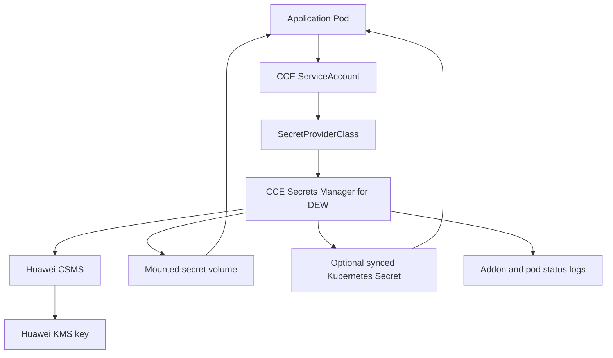
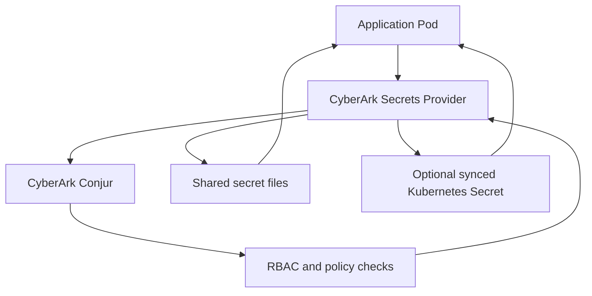
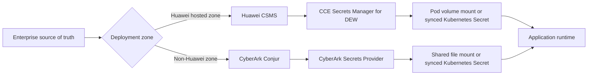
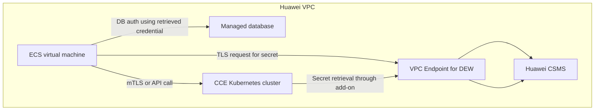
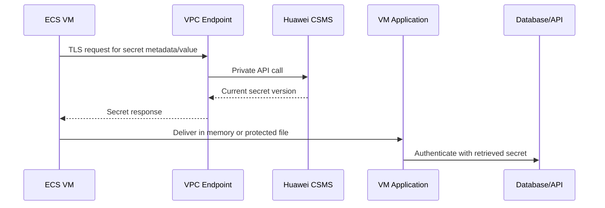
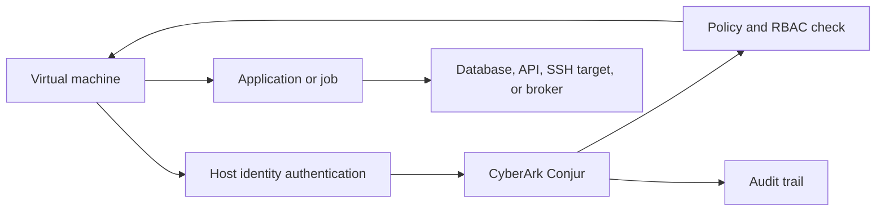
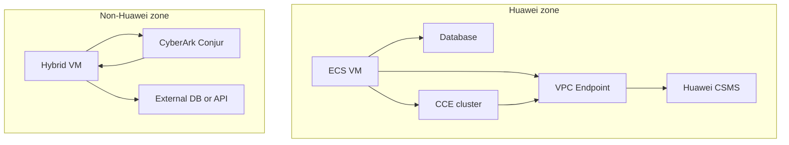
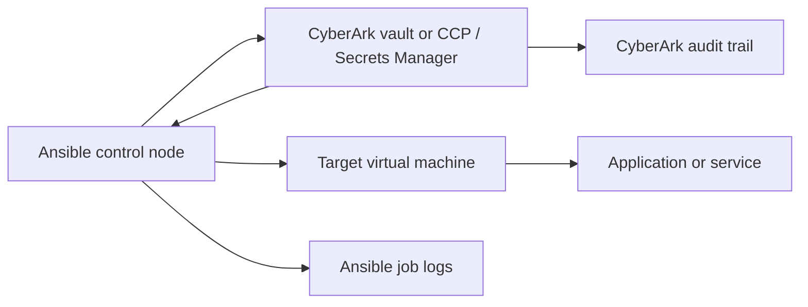
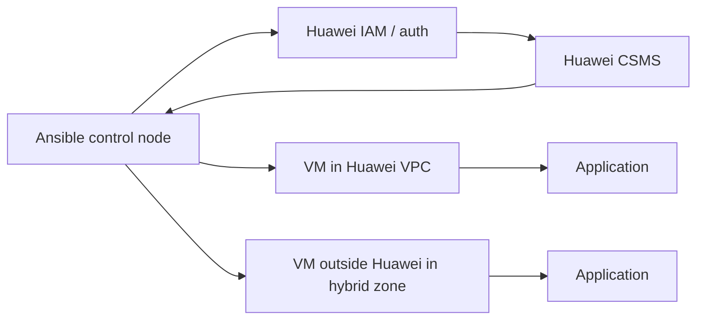
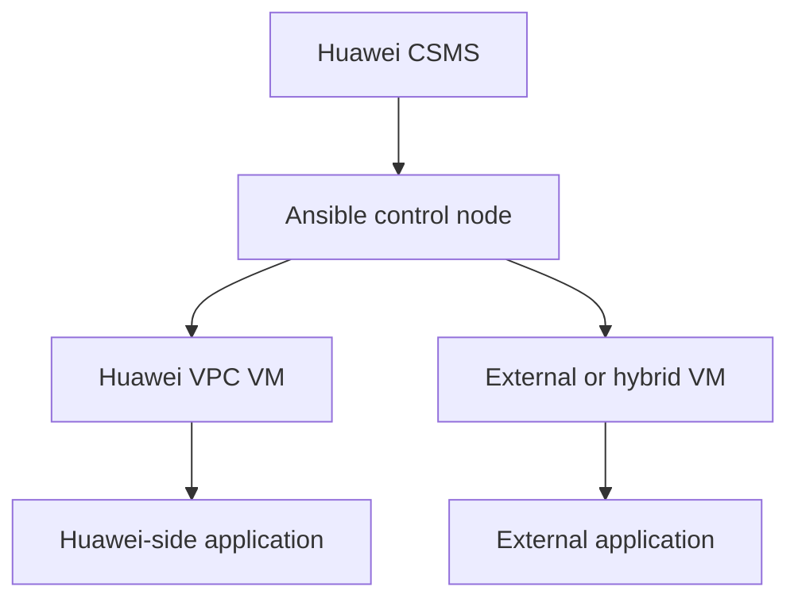

# Secrets Management Implementation Guide v1.1

**Organization Type:** Critical Financial Services Provider  
**Document Type:** Implementation Guide  
**Version:** 1.1  
**Classification:** Internal Restricted  
**Review Cycle:** Annual  
**Companion Standards:** Secrets, Keys, and Cryptography Technical Standards v1.4

**Status:** Approved Implementation Guide

---

## Table of Contents

1. [Purpose and Scope](#1-purpose-and-scope)
2. [Implementation Model](#2-implementation-model)
3. [Platform Mapping](#3-platform-mapping)
4. [Huawei Cloud Secret Management Service (CSMS)](#4-huawei-csms)
5. [AWS Secrets Manager](#5-aws-secrets-manager)
6. [HashiCorp Vault](#6-hashicorp-vault)
7. [Kubernetes CSI Drivers](#7-kubernetes-csi-drivers)
8. [VMware Integration](#8-vmware-integration)
9. [Shared Responsibility Matrices](#9-shared-responsibility-matrices)
10. [Migration and Onboarding](#10-migration-and-onboarding)
11. [Troubleshooting and Operations](#11-troubleshooting-and-operations)

**Appendices:**
A. [API Examples and YAML](#appendix-a-api-examples)
B. [Control Mapping to Standards Doc #2](#appendix-b-control-mapping)

---

## 1. Purpose and Scope

This guide provides platform-specific implementation patterns for **secrets management only** (API keys, service credentials, tokens, passwords). 

**Cryptographic key management** (KMS/vHSM/HSM) is covered in the companion **Cryptography Management Implementation Guide**.

**Reference:** Secrets, Keys, and Cryptography Technical Standards v1.4 (Standards Doc #2) for lifecycle requirements, inventory schemas, and control IDs.

### 1.1 Objectives

- Provide tested patterns for each platform.
- Map platform capabilities to Standards Doc #2 controls.
- Document shared responsibility splits.
- Enable consistent secrets handling across hybrid infrastructure.

### 1.2 Platforms Covered

| Platform | Secrets Service | Status |
|----------|-----------------|--------|
| Huawei Cloud | CSMS (DEW) | Primary private cloud |
| AWS | Secrets Manager | Public cloud primary |
| VMware | HashiCorp Vault | On-prem/VMware |
| Kubernetes | CSI drivers | Multi-platform |
| Hybrid | Cross-platform patterns | All environments |

---

## 2. Implementation Model

### 2.1 Core Principles

All implementations must satisfy Standards Doc #2 requirements:

- **Inventory**: Metadata (owner/consumer/rotation policy)
- **Storage**: Encrypted at rest (KMS-backed)
- **Delivery**: Runtime fetch (no static storage)
- **Rotation**: Automated where possible
- **Audit**: Full access logging to SIEM

### 2.2 Decision Framework

| Use Case | Recommended Platform |
|----------|---------------------|
| Huawei-hosted workloads | CSMS |
| AWS-hosted workloads | Secrets Manager |
| VMware/on-prem | Vault |
| Kubernetes (any cloud) | CSI drivers |
| Cross-cloud hybrid | Vault as central hub |

---

## 3. Platform Mapping

| Platform Capability | Huawei CSMS | AWS Secrets | Vault | K8s CSI |
|---------------------|-------------|-------------|-------|---------|
| Versioning | Yes | Yes | Yes | Provider-dependent |
| Rotation | Scheduled | Lambda | Leases/policies | Pod restart |
| Access Policy | IAM roles | IAM policies | ACL/policies | RBAC + provider |
| Audit Logs | Cloud logs | CloudTrail | Audit devices | K8s audit + provider |
| KMS Integration | Native | KMS | Transit | Provider |

---

## 4. Huawei Cloud Secret Management Service (CSMS)

### 4.1 Overview

Huawei CSMS (part of DEW) provides secrets storage, versioning, rotation, and KMS-backed encryption.

**Maps to Standards Doc #2:**
- Inventory: CSMS tags → ID-SEC-01
- Storage: KMS encryption → PR-SEC-02
- Rotation: Scheduled → SEC-LC-05

### 4.2 Core Patterns

**Pattern 1: Application Secret Storage**
```yaml
# Create secret
curl -X POST https://csms.cn-north-4.myhuaweicloud.com/v1/{project_id}/secrets \\
  -H "X-Auth-Token: {token}" \\
  -d '{{"name": "payments-db", "secret_string": "{encrypted_payload}", "kms_key_id": "{cmk_arn}"}}'
```

**Pattern 2: Rotation**
- Use CSMS rotation jobs linked to Lambda-equivalent functions.
- Reference Standards Doc #2 SEC-LC-05 for policy.

### 4.3 Integration Points

- **CCE Kubernetes**: Secrets Manager for DEW CSI driver.
- **ECS VMs**: SDK retrieval over VPC endpoint.
- **Logs**: Cloud Log Service → SIEM.

---

## 5. AWS Secrets Manager

### 5.1 Overview

AWS Secrets Manager for secrets storage/retrieval/rotation with KMS integration.

**Maps to Standards Doc #2:**
- Versioning: Automatic → ID-SEC-02
- Access: IAM policies → PR-IAM-01

### 5.2 Core Patterns

**Pattern 1: Lambda Rotation**
```json
{{
  "SecretId": "payments-db",
  "KmsKeyId": "alias/my-cmk",
  "RotationLambdaARN": "arn:aws:lambda:region:account:function:RotateDBSecret"
}}
```

**Pattern 2: ECS/EC2 Retrieval**
```python
import boto3
client = boto3.client('secretsmanager')
secret = client.get_secret_value(SecretId='app-secret')['SecretString']
```

---

## 6. HashiCorp Vault (VMware/On-Prem)

### 6.1 Overview

Enterprise secrets engine for VMware/on-prem with dynamic secrets and leases.

### 6.2 Core Patterns

**Dynamic DB Credentials:**
```
vault write database/config/mysql \
    plugin_name=mysql-database-plugin \
    allowed_roles="payments-app" \
    connection_url="root:{{password}}@tcp(mysql:3306)/" \
    username="root" \
    password="supersecret"
```

**Lease-based Rotation:**
```
vault read -format=json database/creds/payments-app | jq '.lease_duration'
```

---

## 7. Kubernetes CSI Drivers

### 7.1 Multi-Platform CSI Patterns

**Huawei CCE + CSMS CSI:**
```yaml
apiVersion: secrets-store.csi.x-k8s.io/v1
kind: SecretProviderClass
metadata:
  name: csms-provider
spec:
  provider: cce
  parameters:
    objects:
    - objectName: payments-db
      objectType: csms
```

**AWS EKS + Secrets Manager:**
```yaml
spec:
  provider: aws
  parameters:
    objects: |
      - objectName: "arn:aws:secretsmanager:..."
        objectType: "secretsmanager"
```

---

## 8. VMware Integration

**Vault Agent on vSphere VMs:**
```
vault agent -config=/etc/vault-agent.hcl
```

**Integration w/ vCenter/NSX:**
- Vault for service creds
- Reference vHSM (Companion Doc #4) for keys

---

## 9. Shared Responsibility Matrices

### 9.1 Huawei Cloud

| Control | Enterprise | Huawei |
|---------|------------|---------|
| Secret Storage | CSMS config/policy | Availability/SLA |
| Encryption Keys | KMS CMK custody | KMS service |
| Access Logs | SIEM integration | Raw logs |

### 9.2 AWS

| Control | Enterprise | AWS |
|---------|------------|---------|
| Secret Rotation | Lambda code | Secrets Manager engine |
| KMS Keys | CMK policy | KMS service |
| Audit | CloudTrail subscription | Log delivery |

---

## 10. Migration and Onboarding

1. Inventory existing hard-coded secrets
2. Map to platform patterns above
3. Test rotation end-to-end
4. Cutover w/ dual-read validation

---

## 11. Troubleshooting and Operations

**Common Issues:**
| Issue | Platform | Resolution |
|-------|----------|------------|
| Rotation failure | CSMS | Check KMS permissions |
| CSI mount fail | K8s | ServiceAccount annotation |

**Monitoring:**
- Secret access volume anomalies
- Rotation job failures
- Lease expiry alerts

---

# Appendix A. Huawei, CyberArk, and Kubernetes Implementation Profiles

This appendix extends the framework with a split-platform implementation model for Huawei-hosted infrastructure, non-Huawei infrastructure, and Kubernetes runtime delivery patterns.

## A.1 Appendix purpose

This appendix defines how the enterprise should implement secrets management when:

- workloads run on Huawei-hosted cloud or Huawei-aligned private cloud platforms,
- workloads run outside Huawei infrastructure and require enterprise vaulting,
- applications run on Kubernetes and need externalized secret delivery.

The appendix does not replace the core lifecycle, audit, inventory, rotation, escrow, and incident-response requirements in Chapters 1 to 20. It applies those requirements to specific deployment patterns.

## A.2 Platform split model

| Environment / operating zone | Primary secret platform | Typical usage | Delivery pattern |
|---|---|---|---|
| Huawei-hosted cloud or Huawei-aligned private cloud | Huawei Cloud Secret Management Service (CSMS) under DEW | Application secrets, DB credentials, service secrets, selected API keys | CCE Secrets Manager for DEW via SecretProviderClass and ServiceAccount scoping |
| Huawei CCE Kubernetes clusters | Huawei CSMS + CCE Secrets Manager for DEW | Pod-mounted secrets, file delivery, selected synchronized Kubernetes Secrets | CSI-based mount first, Kubernetes Secret sync only when required |
| Non-Huawei cloud, hybrid, or on-prem zones | CyberArk-integrated retrieval, including Ansible lookup-based retrieval from CyberArk vault services where Conjur is not available | Service secrets, machine credentials, CI/CD secrets, VM bootstrap secrets, non-Huawei runtime secrets | Ansible lookup and injection, sidecar, init container, shared file volume, or controlled Kubernetes Secret sync |
| Enterprise crypto custody | HSM / KMS / PKI platform from the core framework | KEKs, CA keys, signing keys, high-assurance private keys | HSM-backed operations only |

## A.3 Huawei implementation profile

Huawei documentation describes Cloud Secret Management Service as part of DEW for centrally managing secrets, storing encrypted secret versions, supporting secret creation and versioning, and using either a default `csms/default` key or a user-defined symmetric KMS key for encryption. [R11](https://support.huaweicloud.com/intl/en-us/usermanual-dew/dew_01_9993.html)[R11](https://support.huaweicloud.com/intl/en-us/usermanual-dew/dew_01_9993.html)[R10](https://support.huaweicloud.com/eu/usermanual-dew/dew_01_2000.html)

Huawei also documents the CCE Secrets Manager for DEW add-on as integrating CCE with DEW so secrets managed outside the cluster can be mounted to service pods, with scheduled rotation support when `objectVersion` is set to `latest` and real-time detection of `SecretProviderClass` changes. [R13](https://support.huaweicloud.com/intl/en-us/usermanual-cce/cce_10_0370.html)

### A.3.1 Huawei design principles

- Use Huawei CSMS as the system of record for secrets primarily consumed by Huawei-hosted workloads. [R10](https://support.huaweicloud.com/eu/usermanual-dew/dew_01_2000.html)[R13](https://support.huaweicloud.com/intl/en-us/usermanual-cce/cce_10_0370.html)
- Use customer-managed KMS keys for Tier 1 and Tier 2 Huawei-hosted secrets instead of relying only on the default CSMS key. [R11](https://support.huaweicloud.com/intl/en-us/usermanual-dew/dew_01_9993.html)
- Tag every secret with owner, environment, application, sensitivity tier, and rotation policy so the inventory remains complete and aligned to Chapter 8 requirements. [R11](https://support.huaweicloud.com/intl/en-us/usermanual-dew/dew_01_9993.html)
- Prefer runtime secret mounting into pods over hard-coded values, plaintext manifests, or manual distribution. [R13](https://support.huaweicloud.com/intl/en-us/usermanual-cce/cce_10_0370.html)

### A.3.2 Huawei reference architecture



### A.3.3 Huawei control requirements

| Control area | Huawei-specific requirement |
|---|---|
| Authorization | Restrict each workload through `ServiceAccount` annotations so only explicitly named secrets can be mounted |
| Versioning | Use explicit secret versions for deterministic deployments; use `latest` only where controlled refresh is intended |
| Rotation | Configure `rotation_poll_interval` to match application tolerance, restart behavior, and risk level |
| Delivery model | Use file or volume delivery as the default; sync to Kubernetes Secrets only when compatibility demands it |
| Monitoring | Collect dew-provider, CSI driver, and `spcPodStatus` telemetry for audit and troubleshooting |
| KMS usage | Use customer-managed KMS keys for higher sensitivity tiers |
| Failure mode | Pod startup should fail or block if undeclared secrets are requested |

### A.3.4 Huawei Kubernetes example: mount CSMS secrets as files

```yaml
apiVersion: v1
kind: ServiceAccount
metadata:
  name: finance-app-sa
  annotations:
    cce.io/dew-resource: '["payments-db-secret","hsm-client-secret"]'
---
apiVersion: secrets-store.csi.x-k8s.io/v1
kind: SecretProviderClass
metadata:
  name: finance-app-spc
spec:
  provider: cce
  parameters:
    objects: |
      - objectName: "payments-db-secret"
        objectType: "csms"
        objectVersion: "latest"
      - objectName: "hsm-client-secret"
        objectType: "csms"
        objectVersion: "v1"
---
apiVersion: apps/v1
kind: Deployment
metadata:
  name: finance-app
spec:
  replicas: 1
  selector:
    matchLabels:
      app: finance-app
  template:
    metadata:
      labels:
        app: finance-app
    spec:
      serviceAccountName: finance-app-sa
      volumes:
        - name: secrets-store-inline
          csi:
            driver: secrets-store.csi.k8s.io
            readOnly: true
            volumeAttributes:
              secretProviderClass: "finance-app-spc"
      containers:
        - name: finance-app
          image: finance-app:latest
          volumeMounts:
            - name: secrets-store-inline
              mountPath: /mnt/secrets
              readOnly: true
```

### A.3.5 Huawei Kubernetes example: synchronize selected values to a Kubernetes Secret

```yaml
apiVersion: secrets-store.csi.x-k8s.io/v1
kind: SecretProviderClass
metadata:
  name: finance-app-sync
spec:
  provider: cce
  parameters:
    objects: |
      - objectName: "payments-db-secret"
        objectType: "csms"
        objectVersion: "latest"
        jmesPath:
          - path: username
            objectAlias: dbusername
          - path: password
            objectAlias: dbpassword
  secretObjects:
    - secretName: finance-db-credentials
      type: Opaque
      data:
        - objectName: dbusername
          key: username
        - objectName: dbpassword
          key: password
```

### A.3.6 Huawei operating notes

- Treat synchronized Kubernetes Secrets as secondary copies rather than the enterprise source of truth.
- For higher-sensitivity workloads, prefer file-based or volume-based delivery over environment-variable exposure.
- Record the CSMS secret name, version, KMS key, consuming namespace, and service account in the enterprise inventory.

## A.4 CyberArk implementation profile

CyberArk documents the Secrets Provider for Kubernetes as able to populate either Kubernetes Secrets or shared volume files with secrets stored and managed in Conjur. CyberArk also documents deployment options including sidecar or init-container mode inside an application pod and a namespace-level service model. [R14](https://docs.cyberark.com/conjur-open-source/latest/en/content/integrations/k8s-ocp/cjr-secrets-provider-lp.htm)[R15](https://www.conjur.org)

### A.4.1 CyberArk design principles

- Use CyberArk Conjur as the primary platform for secrets outside Huawei-hosted infrastructure. [R14](https://docs.cyberark.com/conjur-open-source/latest/en/content/integrations/k8s-ocp/cjr-secrets-provider-lp.htm)[R15](https://www.conjur.org)
- Scope Conjur policies by application, namespace, environment, and host or workload identity. [R15](https://www.conjur.org)
- Prefer explicit secret mappings rather than broad wildcard retrieval, because CyberArk notes that fetch-all patterns can expose more secrets than necessary if a workload is compromised. [R14](https://docs.cyberark.com/conjur-open-source/latest/en/content/integrations/k8s-ocp/cjr-secrets-provider-lp.htm)
- Prefer sidecar or init-container delivery with shared files when applications can consume files directly. [R14](https://docs.cyberark.com/conjur-open-source/latest/en/content/integrations/k8s-ocp/cjr-secrets-provider-lp.htm)
- Use Kubernetes Secret synchronization only when application compatibility requires native Secret objects. [R14](https://docs.cyberark.com/conjur-open-source/latest/en/content/integrations/k8s-ocp/cjr-secrets-provider-lp.htm)

### A.4.2 CyberArk reference architecture



### A.4.3 CyberArk delivery options

| Delivery option | Use case | Notes |
|---|---|---|
| Sidecar or init container | Preferred for app-specific delivery | Secrets exposed as shared local files |
| Namespace service model | Namespace-wide service pattern | Supports multiple apps in one namespace |
| Kubernetes Secret sync | Compatibility for apps expecting native Secrets | Adds another in-cluster copy |
| Push-to-file | Minimal application change pattern | Good for file-based secret consumption |

### A.4.4 CyberArk Kubernetes example: sidecar or init-container pattern

```yaml
apiVersion: apps/v1
kind: Deployment
metadata:
  name: conjur-finance-app
spec:
  replicas: 1
  selector:
    matchLabels:
      app: conjur-finance-app
  template:
    metadata:
      labels:
        app: conjur-finance-app
    spec:
      serviceAccountName: conjur-finance-app
      volumes:
        - name: conjur-secrets
          emptyDir:
            medium: Memory
      initContainers:
        - name: cyberark-secrets-provider
          image: cyberark/secrets-provider-for-k8s:latest
          volumeMounts:
            - name: conjur-secrets
              mountPath: /conjur/secrets
      containers:
        - name: app
          image: finance-app:latest
          volumeMounts:
            - name: conjur-secrets
              mountPath: /mnt/secrets
              readOnly: true
```

### A.4.5 CyberArk control requirements

| Control area | Requirement |
|---|---|
| Secret scope | Limit each Conjur host or workload to only required variables |
| Mapping model | Prefer individually mapped secrets rather than fetch-all |
| Namespace isolation | Separate production, non-production, and shared-services namespaces |
| Audit | Ingest Conjur access and policy events into the enterprise SIEM |
| Rotation | Align Conjur rotation workflows with downstream reload capability |
| Duplication control | Minimize long-lived duplication into native Kubernetes Secret objects |

## A.5 Kubernetes-specific controls

Kubernetes documents that Secret objects hold sensitive data such as passwords, OAuth tokens, and SSH keys, and that secret data is stored unencrypted by default in etcd unless encryption at rest is configured. Kubernetes also recommends considering external secret providers through the Secrets Store CSI Driver when confidential data should be kept outside the cluster. [R19](https://kubernetes.io/docs/concepts/security/secrets-good-practices/)

### A.5.1 Mandatory Kubernetes controls

| Control | Requirement |
|---|---|
| etcd encryption | Enable encryption at rest for Kubernetes Secret data |
| RBAC | Restrict `get`, `watch`, and especially `list` access on Secret objects to the minimum required principals |
| Namespace isolation | Use namespaces to isolate secret access boundaries |
| Pod design | Mount secrets only into containers that need them |
| Manifest hygiene | Do not commit base64-encoded Secret manifests with real secret values to source control |
| External secret providers | Prefer CSI-based or provider-based external secret delivery for higher-value secrets |
| App hygiene | Applications must not log, forward, or expose values after reading them |
| Pod creation rights | Treat users who can create pods that mount secrets as effectively able to access those secrets |

### A.5.2 Kubernetes decision table

| Pattern | Recommended use | Risk note |
|---|---|---|
| Native Kubernetes Secret only | Lower-sensitivity or compatibility edge cases | Requires etcd encryption and strong RBAC |
| External secret via CSI volume mount | Preferred for high-value runtime secrets | Keeps source of truth outside cluster |
| Synced Kubernetes Secret from external store | Transitional or compatibility use | Duplicates secret material into cluster state |
| Environment variable from Secret | Only when app cannot consume files or external retrieval | Higher exposure through process and debugging surfaces |

### A.5.3 Enterprise Kubernetes pattern



## A.6 Standards statements to add

1. Huawei-hosted workloads must use Huawei CSMS as the default secrets platform unless an approved exception exists. [R10](https://support.huaweicloud.com/eu/usermanual-dew/dew_01_2000.html)[R13](https://support.huaweicloud.com/intl/en-us/usermanual-cce/cce_10_0370.html)
2. Non-Huawei workloads should use CyberArk-integrated retrieval as the default enterprise pattern for application and machine secrets outside Huawei infrastructure, with Ansible-based retrieval used where Conjur is not available. [R14](https://docs.cyberark.com/conjur-open-source/latest/en/content/integrations/k8s-ocp/cjr-secrets-provider-lp.htm)[R15](https://www.conjur.org)[R16](https://docs.ansible.com/projects/ansible/latest/collections/community/general/cyberarkpassword_lookup.html)[R17](https://docs.cyberark.com/secrets-manager-sh/13.7/en/content/integrations/ansible.html)
3. Kubernetes platforms must use external secret delivery for Tier 1 and Tier 2 runtime secrets wherever feasible. [R19](https://kubernetes.io/docs/concepts/security/secrets-good-practices/)[R13](https://support.huaweicloud.com/intl/en-us/usermanual-cce/cce_10_0370.html)[R14](https://docs.cyberark.com/conjur-open-source/latest/en/content/integrations/k8s-ocp/cjr-secrets-provider-lp.htm)
4. Any synchronized Kubernetes Secret derived from Huawei CSMS or CyberArk Conjur must be treated as a secondary copy and governed by tighter TTL, RBAC, and audit controls. [R13](https://support.huaweicloud.com/intl/en-us/usermanual-cce/cce_10_0370.html)[R14](https://docs.cyberark.com/conjur-open-source/latest/en/content/integrations/k8s-ocp/cjr-secrets-provider-lp.htm)[R19](https://kubernetes.io/docs/concepts/security/secrets-good-practices/)
5. The enterprise inventory must record the platform of record, delivery mechanism, consuming namespace or workload, service account, and refresh model for each runtime-delivered secret. [R11](https://support.huaweicloud.com/intl/en-us/usermanual-dew/dew_01_9993.html)[R13](https://support.huaweicloud.com/intl/en-us/usermanual-cce/cce_10_0370.html)[R14](https://docs.cyberark.com/conjur-open-source/latest/en/content/integrations/k8s-ocp/cjr-secrets-provider-lp.htm)


## A.7 Virtual machine patterns

These patterns extend the appendix with virtual-machine examples for Huawei VPC environments and non-Huawei zones using CyberArk.

### A.7.1 Huawei VPC pattern: ECS VM to CSMS, database, and CCE in the same VPC

Huawei documents that CCE Secrets Manager for DEW can access DEW through a VPC endpoint, and Huawei VPC guidance notes that ECS communication depends on VPC routing and security-group rules. [R13](https://support.huaweicloud.com/intl/en-us/usermanual-cce/cce_10_0370.html)[R25](https://support.huaweicloud.com/intl/en-us/bestpractice-vpc/vpc-bestpractice-pdf.pdf) In a Huawei-hosted design, an ECS virtual machine, a managed database, and a CCE cluster can operate in the same VPC with security groups and routing constrained to only the required east-west flows. [R25](https://support.huaweicloud.com/intl/en-us/bestpractice-vpc/vpc-bestpractice-pdf.pdf)[R13](https://support.huaweicloud.com/intl/en-us/usermanual-cce/cce_10_0370.html)



#### Example use case

- An ECS-based payment adapter retrieves a database password or API credential from Huawei CSMS over a private VPC endpoint, then opens a TLS-protected session to a database in the same VPC. [R13](https://support.huaweicloud.com/intl/en-us/usermanual-cce/cce_10_0370.html)[R11](https://support.huaweicloud.com/intl/en-us/usermanual-dew/dew_01_9993.html)
- The same ECS VM can call services hosted in a CCE cluster in that VPC, while CCE workloads retrieve their own runtime secrets through the CCE Secrets Manager for DEW integration. [R13](https://support.huaweicloud.com/intl/en-us/usermanual-cce/cce_10_0370.html)
- Security groups should allow only the ECS subnet to reach the database port, the VPC endpoint, and approved CCE service addresses. [R25](https://support.huaweicloud.com/intl/en-us/bestpractice-vpc/vpc-bestpractice-pdf.pdf)

#### Control requirements

| Control | Requirement |
|---|---|
| Network path | Use private VPC routing and a VPC endpoint for DEW so the VM does not depend on public internet access for secret retrieval. [R13](https://support.huaweicloud.com/intl/en-us/usermanual-cce/cce_10_0370.html) |
| Identity | Bind the ECS VM to a managed machine identity or tightly scoped credential used only for CSMS retrieval. [R11](https://support.huaweicloud.com/intl/en-us/usermanual-dew/dew_01_9993.html)[R13](https://support.huaweicloud.com/intl/en-us/usermanual-cce/cce_10_0370.html) |
| Segmentation | Restrict security-group rules so the VM can reach only DEW endpoint addresses, required database ports, and approved CCE services. [R25](https://support.huaweicloud.com/intl/en-us/bestpractice-vpc/vpc-bestpractice-pdf.pdf) |
| Rotation | Application should re-read or refresh secrets after version changes rather than caching indefinitely. [R12](https://support.huaweicloud.com/intl/en-us/usermanual-dew/dew_01_8882.html)[R13](https://support.huaweicloud.com/intl/en-us/usermanual-cce/cce_10_0370.html) |
| Inventory | Record the ECS instance, subnet, VPC, destination database, and related CCE services as source/destination metadata in the master inventory. [R25](https://support.huaweicloud.com/intl/en-us/bestpractice-vpc/vpc-bestpractice-pdf.pdf)[R13](https://support.huaweicloud.com/intl/en-us/usermanual-cce/cce_10_0370.html) |

### A.7.2 Huawei VPC pattern: ECS VM retrieves keys or secrets from CSMS

Huawei documents that CSMS supports secret creation and secret version management, which makes it suitable for VM-based applications that must retrieve current versions of secrets at runtime. [R11](https://support.huaweicloud.com/intl/en-us/usermanual-dew/dew_01_9993.html)[R12](https://support.huaweicloud.com/intl/en-us/usermanual-dew/dew_01_8882.html)



#### Example implementation options

| VM secret use case | Recommended pattern |
|---|---|
| VM needs DB password | Retrieve secret at startup from CSMS, hold in protected memory, and refresh on schedule or on connection failure. [R11](https://support.huaweicloud.com/intl/en-us/usermanual-dew/dew_01_9993.html)[R12](https://support.huaweicloud.com/intl/en-us/usermanual-dew/dew_01_8882.html) |
| VM needs API key for internal service | Read the current CSMS secret version over the VPC endpoint and inject into the application process without writing plaintext to disk. [R13](https://support.huaweicloud.com/intl/en-us/usermanual-cce/cce_10_0370.html)[R11](https://support.huaweicloud.com/intl/en-us/usermanual-dew/dew_01_9993.html) |
| VM needs certificate or private key material | Store only lower-sensitivity exported material in CSMS; keep high-assurance private keys in HSM-backed systems per the main framework. [R11](https://support.huaweicloud.com/intl/en-us/usermanual-dew/dew_01_9993.html) |
| VM batch job needs short-lived credential | Use the VM to fetch a current secret immediately before job execution, then zeroize and terminate after the job finishes. [R12](https://support.huaweicloud.com/intl/en-us/usermanual-dew/dew_01_8882.html) |

### A.7.3 Non-Huawei pattern: VM retrieves secrets from CyberArk

CyberArk describes Conjur as centrally managing secrets across tools, apps, containers, and clouds with policy-based RBAC and audit trails, and CyberArk's VM integration example shows remote nodes retrieving their own secrets using their own identities rather than embedding them directly in automation tools. [R15](https://www.conjur.org)[R20](https://developer.cyberark.com/blog/technical-deep-dive-using-conjur-secrets-in-vm-deployed-ansible-tower-applications/)



#### Example use cases

- A non-Huawei VM running an application retrieves a database password or API token from Conjur at startup using the VM's own identity and then connects to the downstream service. [R15](https://www.conjur.org)[R20](https://developer.cyberark.com/blog/technical-deep-dive-using-conjur-secrets-in-vm-deployed-ansible-tower-applications/)
- An automation VM retrieves SSH private-key material or an external secret through Conjur only for the duration of a runbook, aligning with CyberArk's example of secrets being made available only to a subset of nodes. [R20](https://developer.cyberark.com/blog/technical-deep-dive-using-conjur-secrets-in-vm-deployed-ansible-tower-applications/)
- A hybrid enterprise can keep Huawei-zone workloads on CSMS and use Conjur as the cross-platform vault for non-Huawei VMs, CI/CD hosts, and external operational zones. [R15](https://www.conjur.org)

### A.7.4 Hybrid VM and Kubernetes pattern

A common enterprise pattern is to place ECS virtual machines, managed databases, and CCE clusters in one Huawei VPC while also operating non-Huawei VMs that use CyberArk. Huawei documents VPC security-group controls for ECS connectivity and CCE integration with DEW, while CyberArk documents centralized policy-based secret distribution across applications and clouds. [R25](https://support.huaweicloud.com/intl/en-us/bestpractice-vpc/vpc-bestpractice-pdf.pdf)[R13](https://support.huaweicloud.com/intl/en-us/usermanual-cce/cce_10_0370.html)[R15](https://www.conjur.org)



### A.7.5 VM operational controls

| Control | Huawei VM using CSMS | VM using CyberArk |
|---|---|---|
| Secret retrieval path | Private VPC endpoint to DEW/CSMS. [R13](https://support.huaweicloud.com/intl/en-us/usermanual-cce/cce_10_0370.html) | Mutual-authenticated or policy-controlled Conjur connection. [R15](https://www.conjur.org) |
| Identity scope | ECS identity or app credential limited to required secrets. [R11](https://support.huaweicloud.com/intl/en-us/usermanual-dew/dew_01_9993.html) | Host identity or machine identity with explicit RBAC. [R15](https://www.conjur.org)[R20](https://developer.cyberark.com/blog/technical-deep-dive-using-conjur-secrets-in-vm-deployed-ansible-tower-applications/) |
| Local storage | Avoid plaintext disk storage; use memory or protected temporary files only when necessary. [R12](https://support.huaweicloud.com/intl/en-us/usermanual-dew/dew_01_8882.html)[R20](https://developer.cyberark.com/blog/technical-deep-dive-using-conjur-secrets-in-vm-deployed-ansible-tower-applications/) | Avoid plaintext disk storage; prefer ephemeral retrieval. [R20](https://developer.cyberark.com/blog/technical-deep-dive-using-conjur-secrets-in-vm-deployed-ansible-tower-applications/) |
| Monitoring | Log CSMS access, VPC endpoint use, DB auth, and downstream calls. [R13](https://support.huaweicloud.com/intl/en-us/usermanual-cce/cce_10_0370.html)[R25](https://support.huaweicloud.com/intl/en-us/bestpractice-vpc/vpc-bestpractice-pdf.pdf) | Log Conjur retrievals, policy decisions, and downstream privileged operations. [R15](https://www.conjur.org) |
| Rotation response | Refresh on secret-version change or app reconnect logic. [R12](https://support.huaweicloud.com/intl/en-us/usermanual-dew/dew_01_8882.html) | Refresh on Conjur rotation or job start. [R20](https://developer.cyberark.com/blog/technical-deep-dive-using-conjur-secrets-in-vm-deployed-ansible-tower-applications/)[R15](https://www.conjur.org) |
| Segmentation | Security groups and route tables restricted to necessary flows. [R25](https://support.huaweicloud.com/intl/en-us/bestpractice-vpc/vpc-bestpractice-pdf.pdf) | Host firewall and network ACLs restricted to Conjur and approved destinations. [R15](https://www.conjur.org) |


## A.7.6 Alternative when Conjur is not available: Ansible with CyberArk

Yes, Ansible can be used to retrieve secrets from CyberArk when Conjur is not available. Ansible documents the `community.general.cyberarkpassword` lookup plugin for retrieving credentials from CyberArk, and CyberArk documents Ansible integrations that enable managed nodes to retrieve secrets from CyberArk Secrets Manager using variables defined on the Ansible control node. [R16](https://docs.ansible.com/projects/ansible/latest/collections/community/general/cyberarkpassword_lookup.html)[R17](https://docs.cyberark.com/secrets-manager-sh/13.7/en/content/integrations/ansible.html)[R17](https://docs.cyberark.com/secrets-manager-sh/13.7/en/content/integrations/ansible.html)[R16](https://docs.ansible.com/projects/ansible/latest/collections/community/general/cyberarkpassword_lookup.html)

This makes Ansible a viable **integration layer** for virtual machines that need just-in-time secret injection, especially during provisioning, configuration, or controlled runtime refresh. The tradeoff is that Ansible becomes part of the secret-delivery path, so the control node, logs, and temporary artifacts must be tightly protected and `no_log: true` must be enforced for secret-bearing tasks. [R16](https://docs.ansible.com/projects/ansible/latest/collections/community/general/cyberarkpassword_lookup.html)[R17](https://docs.cyberark.com/secrets-manager-sh/13.7/en/content/integrations/ansible.html)



### Example: Ansible retrieves a password from CyberArk and injects it into a VM

```yaml
- name: Retrieve CyberArk secret and inject into VM
  hosts: finance_vms
  gather_facts: false
  vars:
    db_secret: >-
      {{ lookup('community.general.cyberarkpassword',
                { 'appid': 'app_ansible',
                  'query': 'safe=Finance;folder=root;object=PaymentsDB',
                  'output': 'Password,PassProps.UserName,PassProps.Address' }) }}
  tasks:
    - name: Create runtime secret directory in memory-backed path
      ansible.builtin.file:
        path: /run/finance-secrets
        state: directory
        owner: root
        group: root
        mode: '0700'

    - name: Write secret to protected runtime file
      ansible.builtin.copy:
        dest: /run/finance-secrets/db.password
        content: "{{ db_secret.Password }}"
        owner: root
        group: app
        mode: '0640'
      no_log: true

    - name: Restart application after secret refresh
      ansible.builtin.service:
        name: finance-app
        state: restarted
```

### Control requirements for Ansible-to-CyberArk injection

| Control | Requirement |
|---|---|
| Control node trust | Treat the Ansible control node as a privileged secret-handling component and harden it to the same standard as the secret platform |
| Task logging | Use `no_log: true` for every task that retrieves, stores, templates, or echoes secret values |
| Delivery target | Prefer memory-backed paths such as `/run` or tmpfs-backed locations over persistent disk |
| Least privilege | Limit the CyberArk application ID, safe, and query scope to only the secrets required by that playbook |
| Lifetime | Inject secrets only for the job or service lifecycle required and rotate or remove them after use |
| Audit | Correlate CyberArk retrieval logs with Ansible job IDs, inventory hostnames, and downstream service restarts |

## A.7.7 Hybrid pattern: Ansible retrieves from Huawei CSMS and injects into VMs

Huawei documents CSMS secret creation and versioning APIs, and the HuaweiCloud Ansible collection provides modules for interacting with Huawei Cloud services. In hybrid environments, Ansible can act as the control-plane orchestrator that authenticates to Huawei APIs, retrieves the required secret version from CSMS, and injects it into a VM running either inside a Huawei VPC or outside Huawei infrastructure. [R11](https://support.huaweicloud.com/intl/en-us/usermanual-dew/dew_01_9993.html)[R18](https://github.com/huaweicloud/huaweicloud-ansible-modules)[R11](https://support.huaweicloud.com/intl/en-us/usermanual-dew/dew_01_9993.html)

This pattern is useful when a virtual machine cannot directly call CSMS at runtime, when outbound internet or endpoint routing is restricted, or when a build or configuration pipeline must place a bootstrap credential onto a VM before the application starts. Because Ansible becomes the transfer point, it must follow the same protection rules as the CyberArk pattern. [R11](https://support.huaweicloud.com/intl/en-us/usermanual-dew/dew_01_9993.html)[R18](https://github.com/huaweicloud/huaweicloud-ansible-modules)



### Example: Ansible retrieves a Huawei secret and writes it to a VM

```yaml
- name: Retrieve Huawei CSMS secret and inject into VM
  hosts: finance_vms
  gather_facts: false
  vars:
    huawei_region: cn-north-4
    csms_endpoint: "https://csms.{{ huawei_region }}.myhuaweicloud.com/v1/{project_id}/secrets/{secret_id}"
    iam_token: "{{ lookup('env', 'HUAWEI_IAM_TOKEN') }}"
  tasks:
    - name: Read secret metadata or current version from Huawei CSMS API
      ansible.builtin.uri:
        url: "{{ csms_endpoint }}"
        method: GET
        headers:
          X-Auth-Token: "{{ iam_token }}"
        return_content: true
      register: huawei_secret
      delegate_to: localhost
      no_log: true

    - name: Create protected runtime directory
      ansible.builtin.file:
        path: /run/finance-secrets
        state: directory
        owner: root
        group: root
        mode: '0700'

    - name: Inject secret into runtime file on VM
      ansible.builtin.copy:
        dest: /run/finance-secrets/api.key
        content: "{{ huawei_secret.json.secret_text | default('REPLACE_WITH_FIELD_MAPPING') }}"
        owner: root
        group: app
        mode: '0640'
      no_log: true
```

### Example: Hybrid flow where Huawei CSMS provides the secret and Ansible injects it to a non-Huawei VM



### Control requirements for Ansible-to-Huawei injection

| Control | Requirement |
|---|---|
| API auth | Use short-lived Huawei IAM tokens or approved API credentials on the control node, not on the target VM |
| Secret field mapping | Map only the fields required by the VM workload and avoid transferring full multi-value payloads unnecessarily |
| Network segmentation | Permit control-node access only to Huawei API endpoints and the target VMs required for the playbook |
| Storage | Use protected runtime files or memory-backed paths on the VM; do not leave bootstrap secrets in cloud-init history or shell history |
| Version awareness | Record the injected secret version so a later rotation can reconcile which hosts received which version |
| Audit | Log the Ansible job ID, target host, secret identifier, and success or failure status without logging secret content |


## A.8 Appendix references

| Ref ID | Reference | Clickable link | Primary appendix use |
|---|---|---|---|
| R10 | Huawei CSMS overview / DEW | [Huawei CSMS Overview](https://support.huaweicloud.com/eu/usermanual-dew/dew_01_2000.html) | Huawei platform baseline |
| R11 | Huawei CSMS create secret | [Huawei Create Secret](https://support.huaweicloud.com/intl/en-us/usermanual-dew/dew_01_9993.html) | Secret creation and secret attributes |
| R12 | Huawei CSMS secret versions | [Huawei Managing Secret Versions](https://support.huaweicloud.com/intl/en-us/usermanual-dew/dew_01_8882.html) | Version-aware retrieval and rotation |
| R13 | Huawei CCE Secrets Manager for DEW | [Huawei CCE Secrets Manager for DEW](https://support.huaweicloud.com/intl/en-us/usermanual-cce/cce_10_0370.html) | Kubernetes integration and VPC-aligned runtime delivery |
| R14 | CyberArk Secrets Provider for Kubernetes | [CyberArk Secrets Provider for Kubernetes](https://docs.cyberark.com/conjur-open-source/latest/en/content/integrations/k8s-ocp/cjr-secrets-provider-lp.htm) | Kubernetes integration outside Huawei |
| R15 | CyberArk Conjur | [CyberArk Conjur](https://www.conjur.org) | CyberArk policy-based secret management reference |
| R16 | Ansible CyberArk lookup plugin | [Ansible CyberArk password lookup](https://docs.ansible.com/projects/ansible/latest/collections/community/general/cyberarkpassword_lookup.html) | Ansible lookup from CyberArk |
| R17 | CyberArk Ansible integration | [CyberArk Ansible integration](https://docs.cyberark.com/secrets-manager-sh/13.7/en/content/integrations/ansible.html) | Ansible-based CyberArk retrieval patterns |
| R18 | HuaweiCloud Ansible collection | [HuaweiCloud Ansible collection](https://github.com/huaweicloud/huaweicloud-ansible-modules) | Hybrid orchestration with Huawei APIs |
| R19 | Kubernetes Secrets good practices | [Kubernetes Secrets good practices](https://kubernetes.io/docs/concepts/security/secrets-good-practices/) | etcd encryption, RBAC, namespace isolation |
| R20 | CyberArk VM integration example | [Conjur secrets in VM applications](https://developer.cyberark.com/blog/technical-deep-dive-using-conjur-secrets-in-vm-deployed-ansible-tower-applications/) | VM retrieval model reference |
| R21 | Hong Kong OCCICS Code of Practice | [OCCICS CoP PDF](https://www.occics.gov.hk/filemanager/en/content_19/CoP_en_v1.0.pdf) | Hong Kong regulatory overlay for local deployment |
| R23 | OWASP API9:2023 Improper Inventory Management | [OWASP API9:2023 Improper Inventory Management](https://owasp.org/API-Security/editions/2023/en/0xa9-improper-inventory-management/) | Inventory and dependency mapping guidance for design and operations |
| R25 | Huawei VPC best practices | [Huawei VPC Best Practices PDF](https://support.huaweicloud.com/intl/en-us/bestpractice-vpc/vpc-bestpractice-pdf.pdf) | VPC segmentation and routing context for VM examples |


# Appendix B: Control Mapping to Standards Doc #2

| Platform Pattern | Maps To Standards Control |
|------------------|---------------------------|
| CSMS tagging | ID-SEC-01 |
| Lambda rotation | SEC-LC-05 |
| Vault leases | PR-SEC-03 |

---

*References Standards Doc #2 for full lifecycle requirements.*

## References

Inline source tags preserved in the document body, such as legacy `Rxx` citations, map to the corresponding `Source ID` values in the external sources table below.

### Internal Documents

| Doc Ref | Document | Version |
|---|---|---|
| DOC-01 | Secrets, Keys, and Cryptography Policy | v1.1 |
| DOC-02 | Secrets, Keys, and Cryptography Technical Standards | v1.4 |
| DOC-03 | Secrets Management Implementation Guide | v1.1 |
| DOC-04 | Cryptography Management Implementation Guide | v1.0 |

### External Sources

| Source ID | Reference | URL |
|---|---|---|
| R11 | R11 | [https://support.huaweicloud.com/intl/en-us/usermanual-dew/dew_01_9993.html](https://support.huaweicloud.com/intl/en-us/usermanual-dew/dew_01_9993.html) |
| R10 | R10 | [https://support.huaweicloud.com/eu/usermanual-dew/dew_01_2000.html](https://support.huaweicloud.com/eu/usermanual-dew/dew_01_2000.html) |
| R13 | R13 | [https://support.huaweicloud.com/intl/en-us/usermanual-cce/cce_10_0370.html](https://support.huaweicloud.com/intl/en-us/usermanual-cce/cce_10_0370.html) |
| R14 | R14 | [https://docs.cyberark.com/conjur-open-source/latest/en/content/integrations/k8s-ocp/cjr-secrets-provider-lp.htm](https://docs.cyberark.com/conjur-open-source/latest/en/content/integrations/k8s-ocp/cjr-secrets-provider-lp.htm) |
| R15 | R15 | [https://www.conjur.org](https://www.conjur.org) |
| R19 | R19 | [https://kubernetes.io/docs/concepts/security/secrets-good-practices/](https://kubernetes.io/docs/concepts/security/secrets-good-practices/) |
| R16 | R16 | [https://docs.ansible.com/projects/ansible/latest/collections/community/general/cyberarkpassword_lookup.html](https://docs.ansible.com/projects/ansible/latest/collections/community/general/cyberarkpassword_lookup.html) |
| R17 | R17 | [https://docs.cyberark.com/secrets-manager-sh/13.7/en/content/integrations/ansible.html](https://docs.cyberark.com/secrets-manager-sh/13.7/en/content/integrations/ansible.html) |
| R25 | R25 | [https://support.huaweicloud.com/intl/en-us/bestpractice-vpc/vpc-bestpractice-pdf.pdf](https://support.huaweicloud.com/intl/en-us/bestpractice-vpc/vpc-bestpractice-pdf.pdf) |
| R12 | R12 | [https://support.huaweicloud.com/intl/en-us/usermanual-dew/dew_01_8882.html](https://support.huaweicloud.com/intl/en-us/usermanual-dew/dew_01_8882.html) |
| R20 | R20 | [https://developer.cyberark.com/blog/technical-deep-dive-using-conjur-secrets-in-vm-deployed-ansible-tower-applications/](https://developer.cyberark.com/blog/technical-deep-dive-using-conjur-secrets-in-vm-deployed-ansible-tower-applications/) |
| R18 | R18 | [https://github.com/huaweicloud/huaweicloud-ansible-modules](https://github.com/huaweicloud/huaweicloud-ansible-modules) |
| EXT-01 | OCCICS CoP PDF | [https://www.occics.gov.hk/filemanager/en/content_19/CoP_en_v1.0.pdf](https://www.occics.gov.hk/filemanager/en/content_19/CoP_en_v1.0.pdf) |
| EXT-02 | OWASP API9:2023 Improper Inventory Management | [https://owasp.org/API-Security/editions/2023/en/0xa9-improper-inventory-management/](https://owasp.org/API-Security/editions/2023/en/0xa9-improper-inventory-management/) |
| EXT-03 | https://docs.aws.amazon.com/secretsmanager/ | [https://docs.aws.amazon.com/secretsmanager/](https://docs.aws.amazon.com/secretsmanager/) |
| EXT-04 | https://developer.hashicorp.com/vault/docs | [https://developer.hashicorp.com/vault/docs](https://developer.hashicorp.com/vault/docs) |
| EXT-05 | https://secrets-store-csi-driver.sigs.k8s.io/ | [https://secrets-store-csi-driver.sigs.k8s.io/](https://secrets-store-csi-driver.sigs.k8s.io/) |

